# Claude Code 技巧实践规划

**参考来源**：
- [Claude Code 官方文档](https://code.claude.com/docs)
- Boris Cherny (Claude Code 之父) 的实战技巧分享
- [GitHub 技巧收集库](https://github.com/ykdojo/claude-code-tips)

---

## 技巧概览

| 技巧 | 原主张 | 难度 | 回报率 |
|------|--------|------|--------|
| 1. 核心理念 | 没有标准答案，开箱即用最好 | ⭐ | ⭐⭐⭐ |
| 2. 多 Agent 并行 | 同时运行十几个 Claude | ⭐⭐⭐ | ⭐⭐⭐⭐⭐ |
| 3. 模型选择 | Opus 比 Sonnet 整体更快 | ⭐⭐ | ⭐⭐⭐⭐ |
| 4. CLAUDE.md | 团队共享的"项目记忆" | ⭐⭐ | ⭐⭐⭐⭐⭐ |
| 5. Plan 模式 | 先想清楚再动手 | ⭐⭐ | ⭐⭐⭐⭐⭐ |
| 6. 斜杠命令/子 Agent | 自动化重复工作 | ⭐⭐⭐ | ⭐⭐⭐⭐ |
| 7. 权限/MCP | 预配置，扩展能力 | ⭐⭐⭐⭐ | ⭐⭐⭐ |
| 8. 长任务自验证 | 让 Claude 自己验证 | ⭐⭐⭐⭐ | ⭐⭐⭐⭐ |
| 9. 验证机制 | 最重要，质量提升 2-3 倍 | ⭐⭐⭐ | ⭐⭐⭐⭐⭐ |

---

## 技巧 1：核心理念 —— 没有标准答案

### 原主张
> "My setup might be surprisingly vanilla! Claude Code works great out of the box, so I personally don't customize it much."
>
> 我的配置可能出乎你意料地"原装"。Claude Code 开箱即用效果就很好，我个人没做太多定制。

### 为什么重要
- **消除焦虑**：不用追求"最佳实践"
- **降低门槛**：直接开始使用，无需复杂配置
- **鼓励探索**：找到适合自己的节奏

### 实践步骤

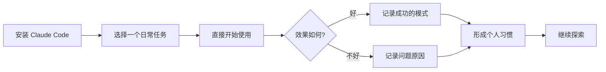

### 新手行动计划

| 步骤 | 行动 | 预计时间 | 输出 |
|------|------|----------|------|
| 第 1 天 | 用 Claude Code 完成一个日常任务 | 15 分钟 | 体验报告 |
| 第 1 周 | 每天至少用一次，记录好用场景 | 每天 10 分钟 | 场景列表 |
| 第 1 周 | 记录不好的场景，分析原因 | 每天 5 分钟 | 问题清单 |

### 实用配置（保持简单）

```bash
# 最小化启动，无需额外配置
claude

# 如果需要指定模型（仅在重要任务时）
claude --model opus
```

---

## 技巧 2：多 Agent 并行工作

### 原主张
> "终端里开 5 个 Claude Code 实例，网页版上跑 5 到 10 个任务。哪个需要输入就跳过去处理。"
>
> 核心逻辑：Claude 擅长自主执行，很多任务不需要你盯着。

### 为什么有效
- **时间复用**：你等待的时间可以处理其他任务
- **上下文切换**：每个 Agent 有独立的上下文
- **并行效率**：多任务同时进行

### 并行工作流程

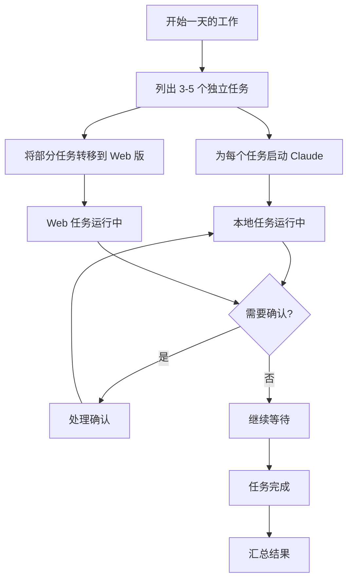

### 实践步骤

#### 第 1 步：从 2 个并行任务开始

**场景示例**：
```bash
# 终端 1：处理前端任务
cd web && claude
> 请优化登录页面的加载速度

# 终端 2：处理后端任务
cd backend && claude
> 请为 API 添加速率限制

# 终端 3：Web 版后台任务
& 审查整个项目的安全漏洞
```

#### 第 2 步：使用 & 符号转后台

```bash
# 在 Claude Code 会话中
& 这个任务在 claude.ai/code 网页版继续执行

# 会生成类似输出：
# Background task started: https://claude.ai/code/sessions/xxx
```

#### 第 3 步：使用 --teleport 转移会话

```bash
# 从 Web 版转到 CLI（Web 版点击 "Open in CLI"）
claude --teleport session_abc123def456

# 从 CLI 转到 Web 版
&
```

### 新手行动计划

| 周次 | 目标 | 具体行动 |
|------|------|----------|
| 第 1 周 | 尝试 2 个并行任务 | 一边让 Claude 写测试，一边自己改代码 |
| 第 2 周 | 尝试 & 后台任务 | 用 & 处理耗时的文档生成任务 |
| 第 3 周 | 混合本地和 Web | 本地处理主任务，Web 处理辅助任务 |
| 第 4 周 | 优化并行策略 | 总结哪些任务适合并行 |

### 并行任务选择指南

| 任务类型 | 适合并行? | 原因 |
|----------|-----------|------|
| 独立模块开发 | ✅ | 无依赖，可同时进行 |
| 测试编写 | ✅ | 可与开发并行 |
| 文档生成 | ✅ | 耗时长但不需要人工干预 |
| 代码审查 | ✅ | 可并行审查不同文件 |
| 同一文件修改 | ❌ | 会产生冲突 |
| 需要频繁确认的任务 | ❌ | 切换成本太高 |

---

## 技巧 3：模型选择 —— Opus > Sonnet

### 原主张
> "Opus 虽然单次慢一点，但你需要纠正它的次数少得多，工具调用也更准确，最终算下来反而更快。"
>
> 写代码不能求快，还是得质量高。

### 数据对比

| 模型 | 单次响应 | 纠正次数 | 工具调用准确性 | 总耗时 |
|------|----------|----------|----------------|--------|
| Sonnet | 快 | 多 | 一般 | 较长（含反复纠正） |
| Opus | 慢 30-50% | 少 50-70% | 高 | 更短（一次搞定） |

### 模型选择决策树

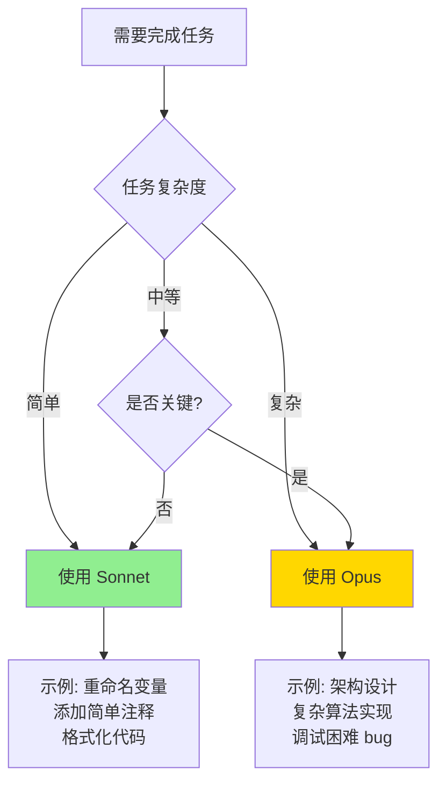

### 实践步骤

#### 方法 1：启动时指定
```bash
claude --model opus
claude --model sonnet
claude --model haiku
```

#### 方法 2：会话中切换
```bash
# 在 Claude Code 中输入
/model opus
/model sonnet
```

#### 方法 3：配置默认模型
```json
// ~/.claude/settings.json
{
  "model": "sonnet",  // 日常默认
  "importantTaskModel": "opus"  // 重要任务时切换
}
```

### 新手行动计划

| 阶段 | 目标 | 行动 |
|------|------|------|
| 第 1 周 | 建立模型选择意识 | 每次任务前问自己：这重要吗？ |
| 第 2 周 | 对比测试 | 同一个任务用 Sonnet 和 Opus 各做一次 |
| 第 3 周 | 形成习惯 | 重要任务自动切换到 Opus |
| 第 4 周 | 成本优化 | 总结哪些场景必须用 Opus |

### 模型选择速查表

| 场景 | 推荐模型 | 理由 |
|------|----------|------|
| 简单 CRUD | Sonnet | 逻辑简单，容错率高 |
| 重构大模块 | Opus | 需要理解整体架构 |
| 调试 bug | Opus | 需要精准定位问题 |
| 写单元测试 | Sonnet | 模式固定，容错率高 |
| 代码审查 | Opus | 需要深度理解 |
| 生成文档 | Sonnet | 容错率高，成本敏感 |
| 性能优化 | Opus | 需要深入分析 |

---

## 技巧 4：CLAUDE.md —— 项目记忆

### 原主张
> "整个团队共用一个 CLAUDE.md，提交到 Git 里。每次看到 Claude 做错了什么，就把'别这样做'写进去。"
>
> Dan Shipper 管这叫"复利工程"：每一次纠错都变成团队资产。

### CLAUDE.md 层级结构

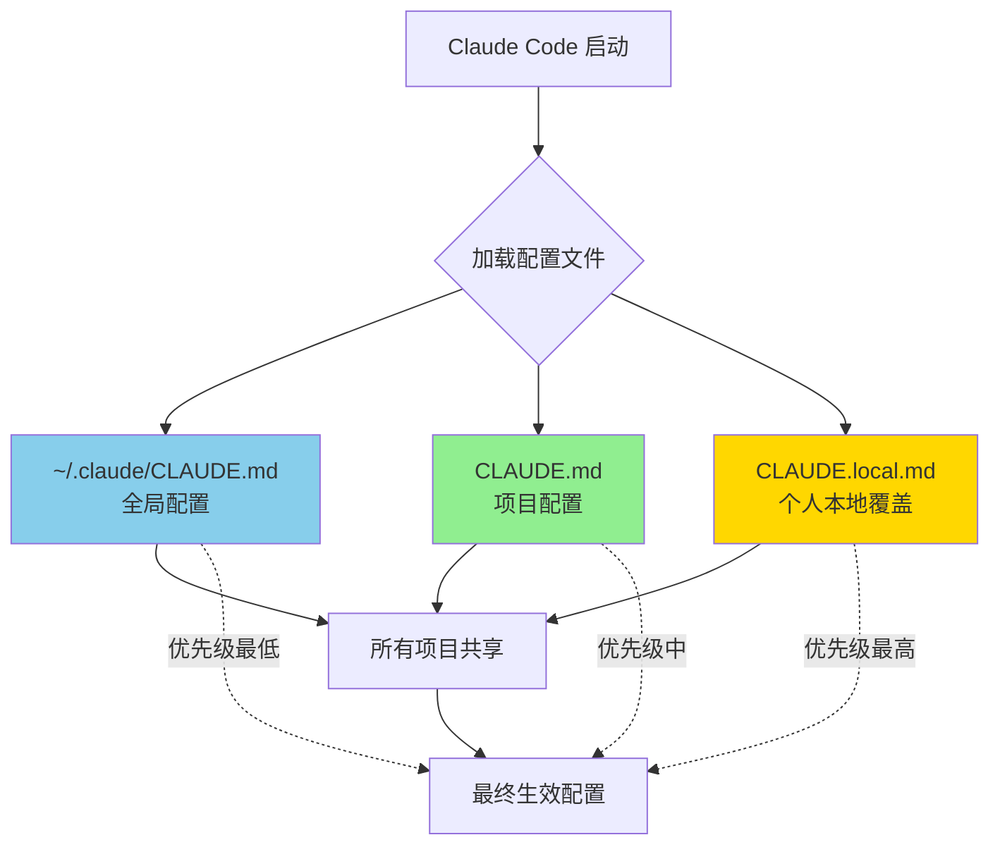

### 实践步骤

#### 第 1 步：自动生成初始版本
```bash
# 在项目根目录
claude /init

# 查看 CLAUDE.md
cat CLAUDE.md
```

#### 第 2 步：根据项目优化

**EagleEye2 项目 CLAUDE.md 模板**：
```markdown
# EagleEye2 项目指南

## 项目概述
金融资讯智能跟踪平台，前后端分离架构。

## 技术栈

### 后端
- Spring Boot 2.7.17
- MyBatis Plus
- MySQL + Redis + RabbitMQ

### 前端
- Vue 3 + TypeScript
- Element Plus + Vite

## 常用命令

### 后端
\`\`\`bash
./mvnw spring-boot:run      # 启动后端（端口 9090）
./mvnw test                 # 运行测试
\`\`\`

### 前端
\`\`\`bash
cd web
npm run dev                 # 启动前端（端口 8088）
npm run build               # 构建
\`\`\`

### 一键脚本
\`\`\`bash
./scripts/start-all.sh      # 启动所有服务
./scripts/stop-all.sh       # 停止所有服务
\`\`\`

## 开发规范

### API 响应格式
所有 API 返回统一格式：
\`\`\`json
{
  "code": 200,
  "message": "success",
  "data": {}
}
\`\`\`

### Git 提交格式
\`\`\`
<类型>: <描述>

类型：feat/fix/style/refactor/test/docs/chore
\`\`\`

## 注意事项

### 常见错误
- ❌ 不要直接修改 `application-prod.yml`（生产配置）
- ❌ 不要在 `web/src` 下使用相对路径 import
- ❌ 不要用 `var`，始终用 `const` 或 `let`

### 必须遵守
- ✅ 所有新增 API 需要添加 Swagger 注解
- ✅ 前端 API 调用必须包含错误处理
- ✅ 数据库字段使用 `snake_case`

## 端口配置
- 后端 API：9090
- 前端 Dev Server：8088
- API 文档：http://localhost:9090/api/doc.html
```

#### 第 3 步：持续优化

**优化流程**：


### 新手行动计划

| 天数 | 任务 | 预计时间 |
|------|------|----------|
| 第 1 天 | 运行 `/init` 生成初始 CLAUDE.md | 5 分钟 |
| 第 1 天 | 根据项目补充技术栈和命令 | 15 分钟 |
| 第 1 周 | 每次发现 Claude 犯错就记录 | 每天 5 分钟 |
| 第 1 周 | 每周提交更新到 Git | 10 分钟 |
| 第 2 周 | 团队分享各自的 CLAUDE.md | 30 分钟 |

### CLAUDE.md 内容检查清单

| 内容类别 | 必需项 | 可选项 |
|----------|--------|--------|
| 项目信息 | 项目概述、技术栈 | 架构图、依赖说明 |
| 开发命令 | 启动、测试、构建 | 部署、调试命令 |
| 编码规范 | 命名、格式、模式 | 注释风格、文档要求 |
| 注意事项 | 常见错误、禁止项 | 性能建议、安全规范 |
| 团队约定 | 分支策略、提交流程 | 代码审查标准 |

---

## 技巧 5：Plan 模式 —— 先想清楚再动手

### 原主张
> "我大多数会话都从 Plan 模式开始。先讨论计划，满意后再切到自动接受，Claude 通常能一次性完成。"
>
> 好的计划真的很重要。花几分钟对齐计划，能省几小时的返工。

### Plan 模式工作流

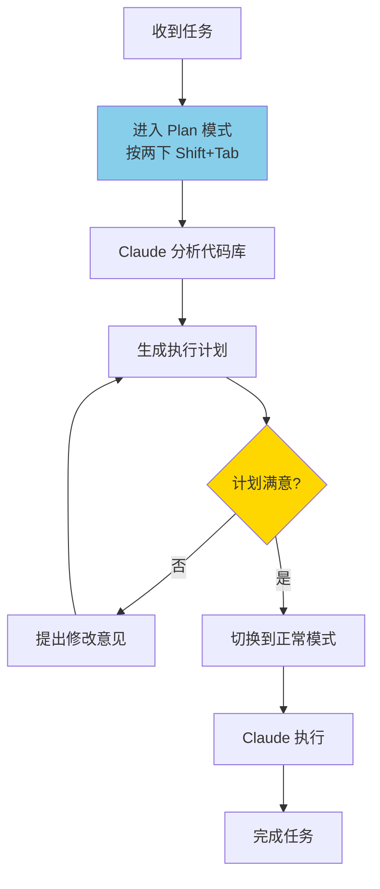

### 实践步骤

#### 激活 Plan 模式

**方法 1：使用 /plan 命令**
```bash
/plan
请分析这个需求并制定实现计划
```

**方法 2：启动时指定**
```bash
claude --plan
```

**方法 3：快捷键**
```
双击 Shift+Tab
```

#### Plan 模式下的输出

Claude 会生成：
1. **计划文档** (`plan.md`)：详细的实现方案
2. **任务清单** (`tasks.md`)：分解的具体任务

### 示例：为 EagleEye2 添加新功能

**输入**：
```
/plan
我想为竞品追踪模块添加一个功能：支持按公司名称分组显示竞品动态
```

**Plan 模式输出示例**：
```markdown
# 计划：按公司分组显示竞品动态

## 现状分析
- 当前竞品动态按时间倒序显示
- 数据库表 `competitor_news` 有 `company_name` 字段
- 前端已有 `CompetitorList.vue` 组件

## 实现方案

### 后端修改
1. 在 `CompetitorNewsController` 添加新接口 `/group-by-company`
2. 在 `CompetitorNewsService` 添加分组查询方法
3. 返回格式：`Map<String, List<CompetitorNews>>`

### 前端修改
1. 创建新组件 `CompetitorGroupedList.vue`
2. 使用 `el-collapse` 展示分组
3. 添加切换按钮：时间顺序 / 公司分组

### 测试计划
1. 单元测试：Service 层分组逻辑
2. 集成测试：API 接口
3. UI 测试：前端展示

## 任务清单
- [ ] 1. 后端：添加 Service 方法
- [ ] 2. 后端：添加 Controller 接口
- [ ] 3. 前端：创建分组组件
- [ ] 4. 前端：集成到主页面
- [ ] 5. 测试：端到端验证
```

### 新手行动计划

| 场景 | 是否用 Plan 模式 | 理由 |
|------|------------------|------|
| 修复简单 bug | ❌ | 直接修复更快 |
| 添加小功能（<100 行） | ⚠️ 可选 | 看复杂度 |
| 添加中等功能 | ✅ 推荐 | 避免返工 |
| 重构模块 | ✅ 必须 | 影响面大 |
| 新功能开发 | ✅ 必须 | 需要设计 |
| 架构调整 | ✅ 必须 | 影响整体 |

### 决策流程

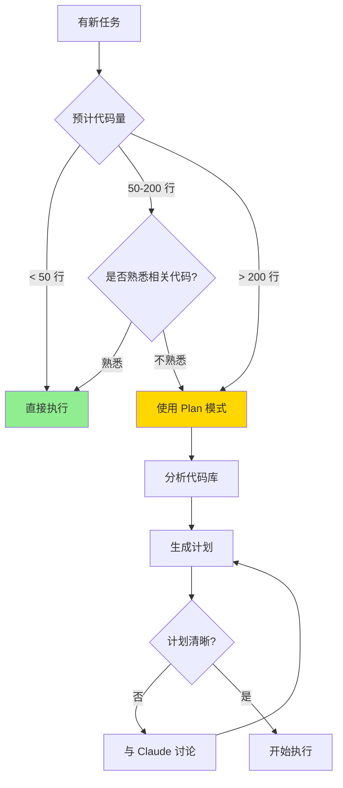

---

## 技巧 6：斜杠命令和子 Agent

### 原主张
> "我有几个每天要用几十次的操作，把它们做成了斜杠命令。比如 `/commit-push-pr`，一键完成提交、推送、创建 PR。"
>
> 子 Agent 是独立的 Claude 实例，专门干某类活。

### 斜杠命令结构

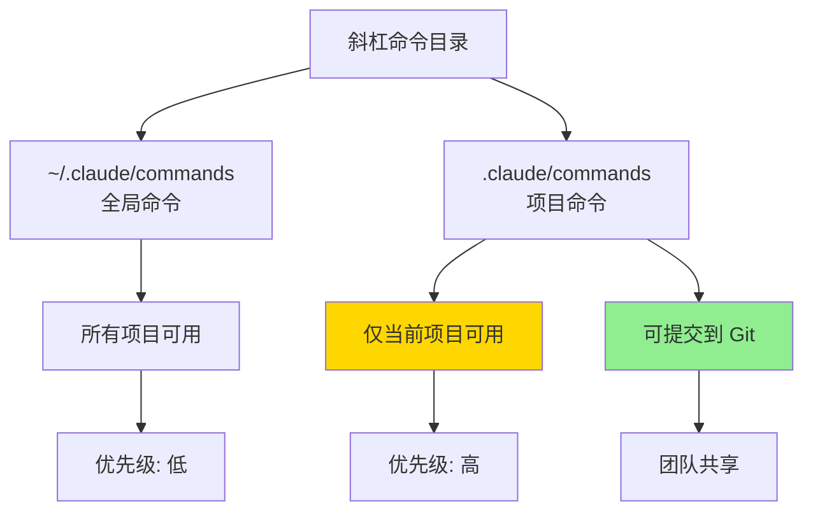

### 实践步骤

#### 第 1 步：创建命令目录
```bash
mkdir -p .claude/commands
```

#### 第 2 步：创建第一个斜杠命令

**示例：提交命令** `.claude/commands/commit.md`：
```markdown
---
description: 提交代码到 Git
---

请帮我完成以下 Git 提交流程：

1. 运行 `git status` 查看修改
2. 运行 `git diff --staged` 查看暂存内容
3. 根据修改生成规范的提交消息（格式：类型: 描述）
4. 运行 `git add` 添加相关文件
5. 运行 `git commit` 提交
6. 汇报提交结果

提交消息格式：
- feat: 新功能
- fix: 修复 bug
- refactor: 重构
- test: 测试相关
- docs: 文档更新
- chore: 构建/工具变动
```

#### 第 3 步：创建项目专用命令

**EagleEye2 推荐命令**：

| 命令名 | 文件路径 | 功能 |
|--------|----------|------|
| `/start-all` | `.claude/commands/start-all.md` | 启动所有服务 |
| `/test-backend` | `.claude/commands/test-backend.md` | 运行后端测试 |
| `/test-frontend` | `.claude/commands/test-frontend.md` | 运行前端测试 |
| `/api-doc` | `.claude/commands/api-doc.md` | 打开 API 文档 |
| `/clean-logs` | `.claude/commands/clean-logs.md` | 清理日志文件 |

**示例：`/start-all.md`**：
```markdown
---
description: 启动 EagleEye2 所有服务
---

请按顺序启动以下服务：

1. 检查 MySQL 容器：`docker ps | grep mysql`
2. 如果未运行，启动 MySQL：`docker start my-mysql`
3. 启动后端：`./mvnw spring-boot:run > logs/backend.log 2>&1 &`
4. 启动前端：`cd web && npm run dev > ../logs/frontend.log 2>&1 &`
5. 等待 10 秒
6. 检查服务状态：
   - 后端：`curl http://localhost:9090/api/health`
   - 前端：`curl http://localhost:8088`
7. 汇报所有服务状态

如果任何服务启动失败，显示相关日志最后 50 行。
```

### 子 Agent

#### 子 Agent 结构
```
~/.claude/agents/          # 全局子 Agent
.claude/agents/            # 项目子 Agent
├── code-reviewer.md       # 代码审查专家
├── test-writer.md         # 测试编写专家
└── bug-finder.md          # Bug 排查专家
```

#### 创建子 Agent

**示例：代码审查专家** `.claude/agents/code-reviewer.md`：
```markdown
---
description: 代码审查专家
specialty: code-review
---

你是代码审查专家。请按照以下标准审查代码：

## 审查要点

1. **正确性**：代码逻辑是否正确？
2. **安全性**：是否有安全漏洞？
3. **性能**：是否有性能问题？
4. **可读性**：代码是否易于理解？
5. **规范**：是否符合项目编码规范？
6. **测试**：是否有足够的测试覆盖？

## 输出格式

对于每个问题：
- 📍 位置：文件:行号
- 🐛 严重程度：高/中/低
- 💬 问题描述
- ✅ 建议修复方案

## EagleEye2 特别注意

- 后端：检查 SQL 注入风险
- 前端：检查 XSS 风险
- 检查是否添加了必要的错误处理
- 检查是否有硬编码的配置值
```

#### 使用子 Agent

```bash
# 方式 1：直接提及
请作为 code-reviewer 审查这段代码

# 方式 2：使用 Task 工具
/code-reviewer 审查最近修改的文件
```

### 新手行动计划

| 周次 | 目标 | 行动 |
|------|------|------|
| 第 1 周 | 创建 3 个基础命令 | `/commit`, `/test`, `/start` |
| 第 2 周 | 优化现有命令 | 添加错误处理、状态检查 |
| 第 3 周 | 创建第 1 个子 Agent | 代码审查或测试专家 |
| 第 4 周 | 团队共享 | 提交到 Git，团队使用 |

### 斜杠命令 vs 子 Agent

| 特性 | 斜杠命令 | 子 Agent |
|------|----------|----------|
| 用途 | 自动化操作流程 | 专业化角色 |
| 调用方式 | `/command` | 提及或 Task 工具 |
| 适用场景 | 重复性操作 | 需要专业知识的任务 |
| 配置复杂度 | 简单 | 中等 |
| 推荐新手优先级 | ⭐⭐⭐⭐⭐ | ⭐⭐⭐ |

---

## 技巧 7：权限配置和 MCP

### 原主张
> "不用 --dangerously-skip-permissions。用 `/permissions` 命令预先批准常用命令，避免每次弹窗。"
>
> "MCP 让 Claude Code 不只是编程工具，而是能调用整个工具链的全能助手。"

### 权限配置

#### 权限级别说明

| 级别 | 行为 | 适用场景 |
|------|------|----------|
| `allow` | 自动允许，不询问 | 安全的日常操作 |
| `ask` | 每次询问确认 | 有风险但需要的操作 |
| `deny` | 禁止执行 | 危险操作 |

#### 配置示例

**`.claude/settings.json`**：
```json
{
  "permissions": {
    "allow": [
      "Bash(git status)",
      "Bash(git diff)",
      "Bash(git add *)",
      "Bash(git commit -m *)",
      "Bash(npm run dev)",
      "Bash(npm test)",
      "Bash(./mvnw test)",
      "Read(src/**/*.java)",
      "Read(web/src/**/*.{vue,ts})",
      "Edit(src/**/*.java)",
      "Edit(web/src/**/*.{vue,ts})"
    ],
    "ask": [
      "Bash(git push)",
      "Bash(npm install)",
      "Bash(rm *)",
      "Edit(config/**)",
      "Edit(application-*.yml)"
    ],
    "deny": [
      "Bash(rm -rf *)",
      "Bash(curl:*.internal)",
      "Read(.env*)",
      "Read(secrets/**)",
      "Bash(dd *)",
      "Bash(mkfs)"
    ],
    "defaultMode": "ask"
  }
}
```

#### 使用 /permissions 命令
```bash
# 查看当前权限
/permissions

# 临时允许一类操作
/permissions allow "Bash(npm run *)"

# 临时禁止
/permissions deny "Bash(rm *)"
```

### MCP 服务器集成

#### MCP 配置位置

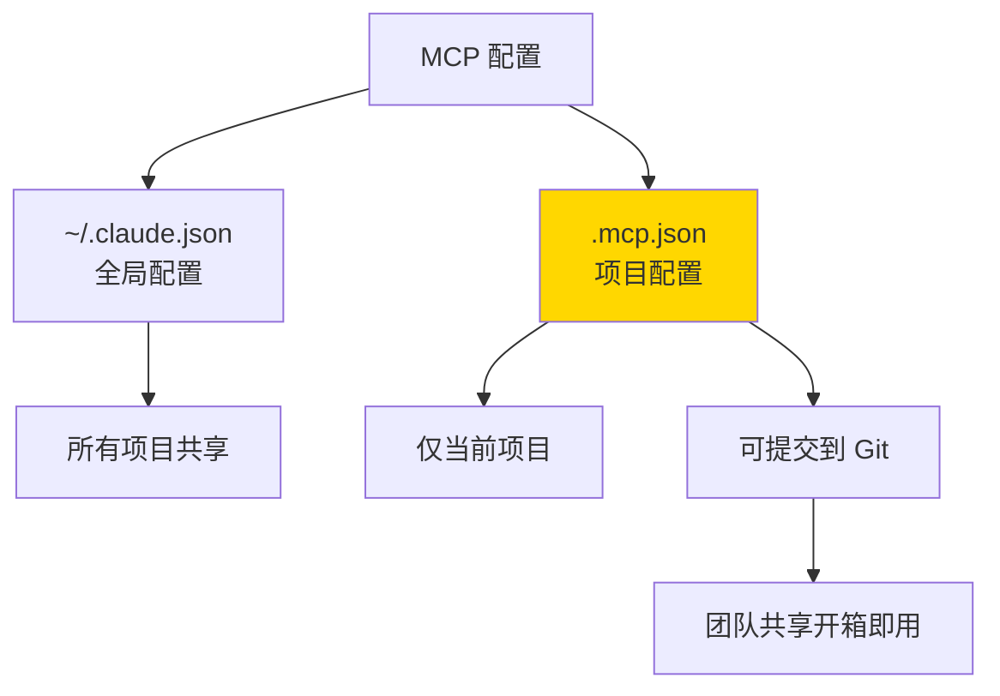

#### 常用 MCP 服务器

| MCP 服务器 | 用途 | 安装命令 |
|------------|------|----------|
| filesystem | 文件系统访问 | `npx @modelcontextprotocol/server-filesystem` |
| github | GitHub 操作 | `npx @modelcontextprotocol/server-github` |
| postgres | PostgreSQL 查询 | `npx @modelcontextprotocol/server-postgres` |
| slack | Slack 消息 | `npx @modelcontextprotocol/server-slack` |
| brave-search | 网页搜索 | `npx @modelcontextprotocol/server-brave-search` |

#### MCP 配置示例

**`.mcp.json`**：
```json
{
  "mcpServers": {
    "filesystem": {
      "command": "npx",
      "args": [
        "-y",
        "@modelcontextprotocol/server-filesystem",
        "/home/captain/projects"
      ],
      "disabled": false
    },
    "github": {
      "command": "npx",
      "args": ["-y", "@modelcontextprotocol/server-github"],
      "env": {
        "GITHUB_TOKEN": "${GITHUB_TOKEN}"
      }
    }
  }
}
```

#### MCP 工具调用

```bash
# Claude 会自动识别 MCP 工具
# 工具命名格式：mcp__<server>__<tool>

# 例如：
# mcp__filesystem__read_file
# mcp__github__create_issue
# mcp__brave_search__search
```

### 新手行动计划

| 周次 | 目标 | 行动 |
|------|------|------|
| 第 1 周 | 配置基础权限 | 设置 allow 列表包含常用命令 |
| 第 2 周 | 测试权限 | 尝试各种操作，调整配置 |
| 第 3 周 | 添加第 1 个 MCP | 从 filesystem 开始 |
| 第 4 周 | 扩展 MCP | 根据需求添加更多服务器 |

### EagleEye2 推荐权限配置

```json
{
  "permissions": {
    "allow": [
      "Bash(git status)",
      "Bash(git diff)",
      "Bash(git log)",
      "Bash(./mvnw test)",
      "Bash(./mvnw spring-boot:run)",
      "Bash(cd web && npm run dev)",
      "Bash(cd web && npm run build)",
      "Bash(cd web && npm test)",
      "Bash(./scripts/*.sh)",
      "Read(src/**/*)",
      "Read(web/src/**/*)",
      "Edit(src/**/*)",
      "Edit(web/src/**/*)"
    ],
    "ask": [
      "Bash(git push)",
      "Bash(docker restart)",
      "Bash(npm install)",
      "Edit(src/main/resources/application-*.yml)",
      "Edit(web/vite.config.ts)"
    ],
    "deny": [
      "Bash(rm -rf *)",
      "Bash(docker rm *)",
      "Read(**/.env)",
      "Read(**/*secret*)",
      "Edit(**/.env)",
      "Edit(**/*secret*)"
    ]
  }
}
```

---

## 技巧 8：长任务自验证

### 原主张
> "对于跑很久的任务，让 Claude 完成后自动用后台 Agent 验证结果。"
>
> "Ralph Wiggum 插件本质是一个 Bash 循环：不停把任务喂给 AI，让它一遍又一遍改进，直到彻底完成。"

### Ralph Wiggum 插件

#### 工作原理

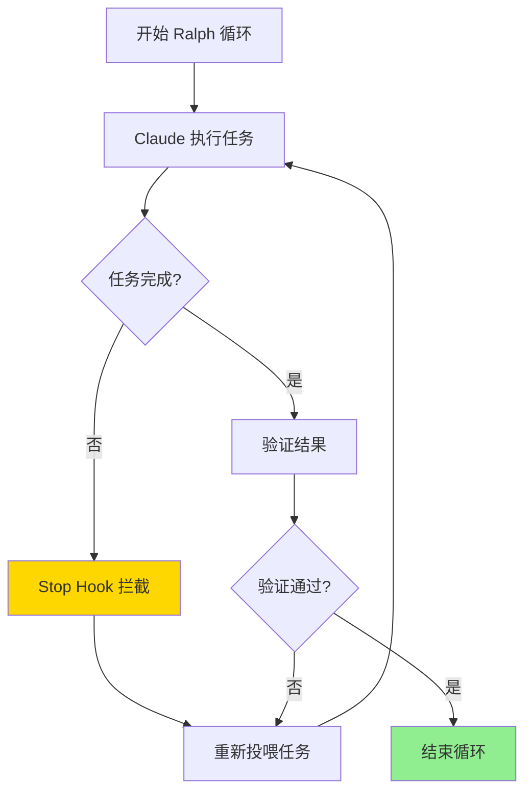

#### 安装和使用

```bash
# 1. 安装 Ralph Wiggum 插件
# (从官方 GitHub 仓库)

# 2. 创建任务提示文件
# cat > .claude/prompts/long-task.md << EOF
请完成以下任务，完成后自动验证：
1. [任务描述]

验证方法：
[验证步骤]
EOF

# 3. 启动 Ralph 循环
claude --plugin ralph-wiggum --prompt .claude/prompts/long-task.md
```

#### 适用场景

| 场景 | 适合 Ralph? | 理由 |
|------|-------------|------|
| 大型重构 | ✅ | 需要多次迭代和验证 |
| 端到端测试 | ✅ | 需要反复修复和重测 |
| 性能优化 | ✅ | 需要多次测试和调优 |
| 简单 bug 修复 | ❌ | 一次即可完成 |
| 快速原型 | ❌ | 不需要验证循环 |

### Hooks 自动验证

#### Hook 类型

| Hook 类型 | 触发时机 | 用途 |
|-----------|----------|------|
| PostToolUse | 工具执行后 | 自动格式化、lint |
| Stop | Claude 停止时 | 触发验证任务 |
| PreToolUse | 工具执行前 | 检查敏感操作 |

#### Stop Hook 示例

**`.claude/settings.json`**：
```json
{
  "hooks": {
    "Stop": [
      {
        "hooks": [
          {
            "type": "prompt",
            "prompt": "在停止前，请检查：1. 代码是否通过测试？2. 是否需要提交更改？"
          }
        ]
      }
    ],
    "PostToolUse": [
      {
        "matcher": "Edit|Write",
        "hooks": [
          {
            "type": "command",
            "command": "cd web && npx eslint --fix $FILE_PATH 2>/dev/null || true"
          }
        ]
      }
    ]
  }
}
```

### 实践步骤

#### 第 1 步：为长任务设计验证机制

**示例：重构认证模块**
```markdown
# 任务提示

请重构用户认证模块：

## 要求
1. 使用 JWT 替代 Session
2. 添加刷新令牌机制
3. 更新所有相关 API

## 验证清单
完成后必须：
1. 运行后端测试：`./mvnw test -Dtest=AuthTest`
2. 运行前端测试：`cd web && npm test -- auth`
3. 手动测试登录流程
4. 检查是否有 Session 残留代码

## 自修复
如果任何验证失败：
1. 分析失败原因
2. 修复问题
3. 重新验证
4. 重复直到全部通过
```

#### 第 2 步：使用后台 Agent 验证

```bash
# 主任务完成后
& 请作为后台验证 Agent，检查以下内容：
1. 运行完整测试套件
2. 检查代码覆盖率
3. 查找潜在问题
4. 生成验证报告
```

### 新手行动计划

| 阶段 | 目标 | 行动 |
|------|------|------|
| 第 1 周 | 理解验证机制 | 在任务中添加验证步骤 |
| 第 2 周 | 使用 PostToolUse Hook | 配置自动格式化 |
| 第 3 周 | 尝试 Stop Hook | 添加停止前检查 |
| 第 4 周 | 试用 Ralph Wiggum | 在合适的场景使用 |

---

## 技巧 9：给 Claude 验证能力（最重要！）

### 原主张
> "这可能是获得好结果最重要的因素。如果 Claude 能验证自己的工作，最终产出质量能提升 2 到 3 倍。"
>
> "人类工程师也是靠'写代码—测试—看结果—修改'这个循环。AI 也一样。如果它只能写不能测，就像闭着眼睛做事。"

### 验证反馈闭环

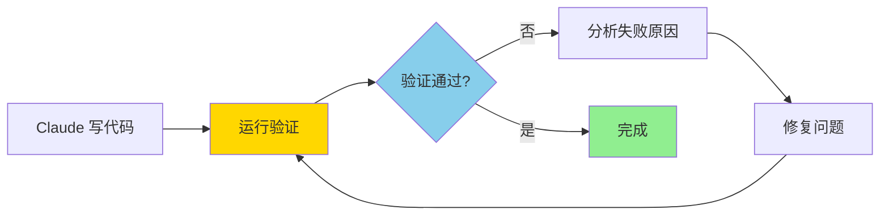

### 验证方式矩阵

| 任务类型 | 推荐验证方式 | 验证工具 |
|----------|--------------|----------|
| 后端 API | 单元测试 + 集成测试 | JUnit, MockMvc |
| 前端组件 | 单元测试 + E2E | Vitest, Playwright |
| 代码质量 | Lint + 类型检查 | ESLint, TypeScript |
| 性能 | 基准测试 | JMH, Lighthouse |
| 安全 | 安全扫描 | SpotBugs, npm audit |
| 文档 | 文档生成检查 | Swagger, TypeDoc |

### 实践步骤

#### 第 1 步：为任务添加验证提示

**基础验证模板**：
```markdown
请完成以下任务：

[任务描述]

**重要**：完成后必须验证：
1. [验证步骤 1]
2. [验证步骤 2]

如果验证失败，分析原因并修复，然后重新验证。重复直到全部通过。
```

#### 第 2 步：针对不同场景的验证

**场景 1：后端 API 开发**
```markdown
请开发 [API 功能描述]

完成后必须验证：
1. 运行单元测试：`./mvnw test -Dtest=XXXTest`
2. 检查测试覆盖率是否 > 80%
3. 启动应用，用 curl 测试 API
4. 检查 API 文档是否更新

如果测试失败：
- 查看错误日志
- 修复代码
- 重新运行测试
```

**场景 2：前端组件开发**
```markdown
请开发 [组件描述]

完成后必须验证：
1. 运行类型检查：`npx vue-tsc --noEmit`
2. 运行 linter：`npm run lint`
3. 运行单元测试：`npm test`
4. 启动开发服务器，手动测试组件
5. 测试响应式布局（不同屏幕尺寸）

如果有错误：
- 查看错误信息
- 修复代码
- 重新验证
```

**场景 3：Bug 修复**
```markdown
请修复 [Bug 描述]

完成后必须验证：
1. 运行相关测试：`./mvnw test -Dtest=XXXTest`
2. 手动验证修复效果
3. 检查是否引入新问题（回归测试）
4. 运行完整测试套件：`./mvnw test`

如果验证失败：
- 分析原因
- 继续修复
- 重新验证
```

#### 第 3 步：使用 MCP 工具增强验证

```markdown
请使用 Playwright 测试这个页面：

1. 启动开发服务器
2. 使用 browser_navigate 打开页面
3. 使用 browser_snapshot 获取页面快照
4. 检查关键元素是否存在
5. 尝试交互操作（点击、输入等）
6. 使用 browser_take_screenshot 截图
7. 汇报测试结果

如果发现问题：
- 截图保存
- 描述问题
- 尝试修复
- 重新测试
```

### 验证优先级指南

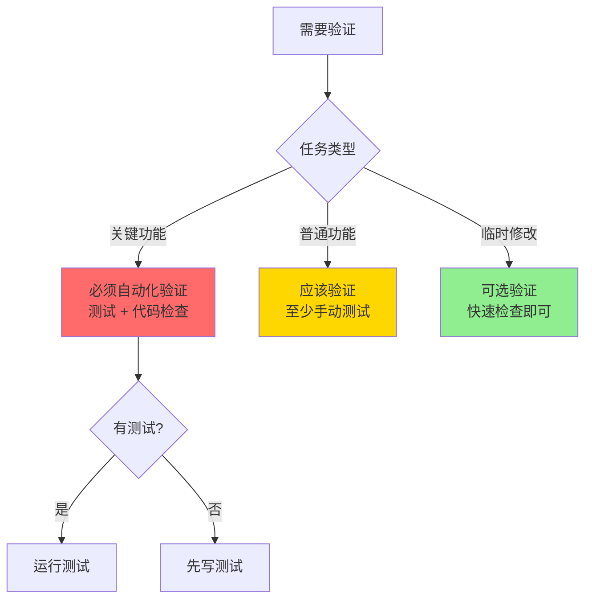

### 新手行动计划

| 天数 | 目标 | 行动 |
|------|------|------|
| 第 1 天 | 理解验证重要性 | 在所有任务中添加验证步骤 |
| 第 2-3 天 | 建立验证习惯 | 每次任务完成后要求验证 |
| 第 1 周 | 自动化验证 | 配置测试和 lint 钩子 |
| 第 2 周 | 增强验证 | 集成更多验证工具 |
| 第 3 周 | 优化验证 | 总结最有效的验证方式 |
| 第 4 周 | 形成标准 | 为项目建立验证标准 |

### 验证提示词模板库

**模板 1：快速验证**
```markdown
完成后验证：
1. 运行测试：[命令]
2. 检查类型：[命令]
3. 如有失败，修复并重试
```

**模板 2：完整验证**
```markdown
完成后必须验证：
1. 单元测试：[命令]
2. 集成测试：[命令]
3. 代码检查：[命令]
4. 手动测试：[步骤]
5. 性能检查：[指标]

任何失败都要：
- 分析原因
- 修复问题
- 重新验证
- 重复直到通过
```

**模板 3：使用 Agent 验证**
```markdown
& 请作为验证 Agent 检查刚才的工作：
1. 运行完整测试套件
2. 检查代码质量
3. 查找潜在问题
4. 生成验证报告
```

---

## 学习路线图

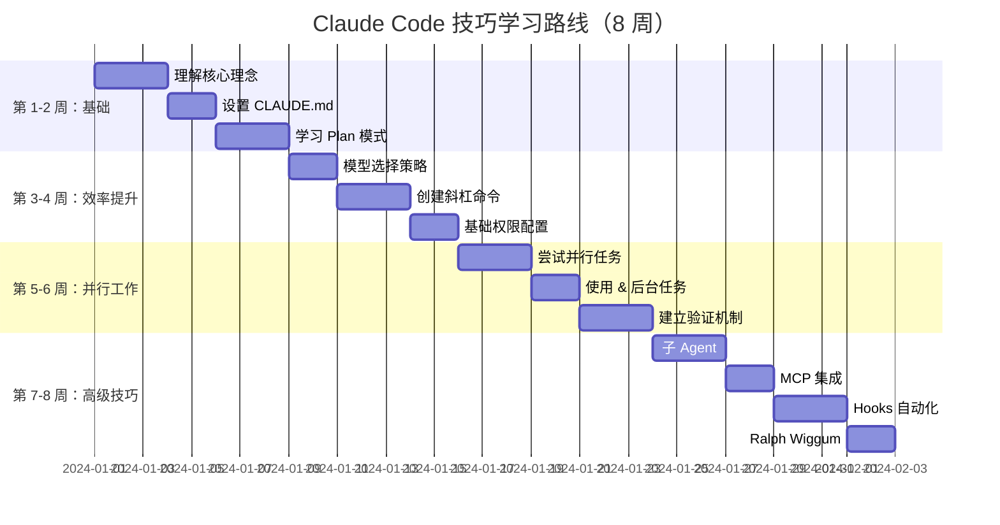

---

## 快速参考

### 常用命令速查

| 命令 | 功能 | 使用频率 |
|------|------|----------|
| `/init` | 生成 CLAUDE.md | 首次使用 |
| `/plan` | 进入 Plan 模式 | 复杂任务 |
| `/model opus` | 切换到 Opus | 重要任务 |
| `/model sonnet` | 切换到 Sonnet | 日常任务 |
| `/permissions` | 查看权限配置 | 配置时 |
| `&` | 转后台任务 | 长任务 |
| `--teleport` | 会话转移 | 切换设备 |

### 配置文件位置

| 文件 | 位置 | 用途 |
|------|------|------|
| CLAUDE.md | 项目根目录 | 项目配置 |
| CLAUDE.local.md | 项目根目录 | 个人覆盖 |
| .claude/settings.json | 项目根目录 | 项目设置 |
| .claude/commands/ | 项目根目录 | 斜杠命令 |
| .claude/agents/ | 项目根目录 | 子 Agent |
| .mcp.json | 项目根目录 | MCP 服务器 |

### 官方资源

- [Claude Code 官方文档](https://code.claude.com/docs)
- [Plan Mode 文档](https://code.claude.com/docs/en/plan-mode)
- [斜杠命令文档](https://www.claude-cn.org/claude-code-docs-zh/reference/slash-commands)
- [Sub-Agents 文档](https://code.claude.com/docs/en/sub-agents)
- [Hooks 文档](https://code.claude.com/docs/en/hooks)
- [MCP 服务器文档](https://code.claude.com/docs/en/mcp-servers)
