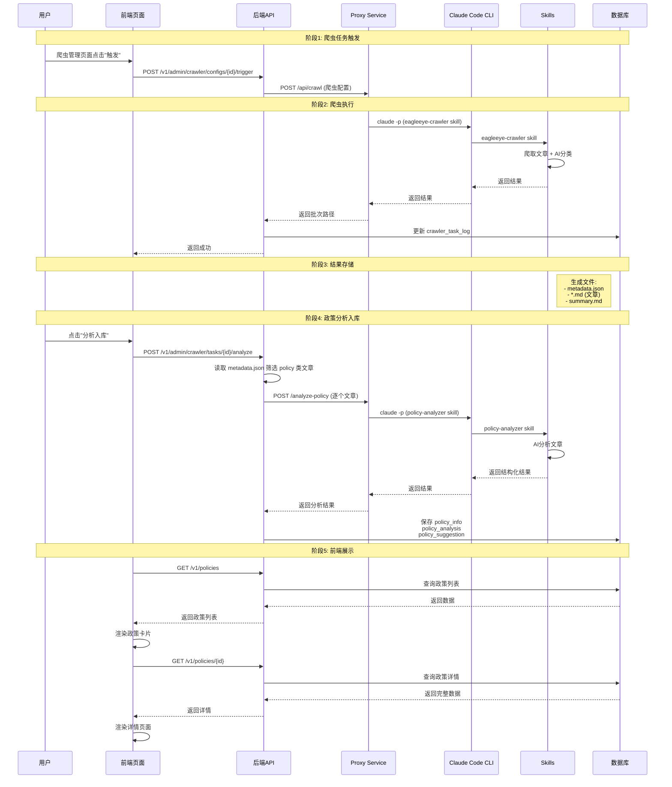
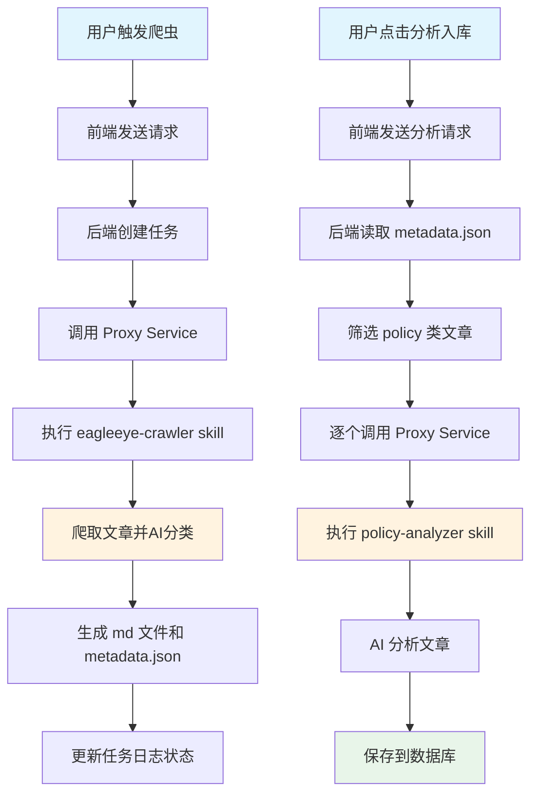

# 政策文章数据流程链文档

## 1. 概述

本文档详细说明了 EagleEye2 项目中"政策文章"从爬取、分析到入库的完整数据流程链。

### 1.1 系统架构

```
┌─────────────────┐      ┌─────────────────┐      ┌─────────────────┐
│   前端 (Vue3)   │ ───> │  后端 (Spring   │ ───> │ Proxy Service   │
│   :8088         │      │   Boot) :9090   │      │   (FastAPI)     │
│                 │ <─── │                 │ <─── │     :8000       │
└─────────────────┘      └─────────────────┘      └────────┬────────┘
                                                                  │
                                                                  v
                                                        ┌─────────────────┐
                                                        │ Claude Code CLI │
                                                        │   + Skills      │
                                                        │  (AI分析)        │
                                                        └─────────────────┘
```

### 1.2 技术栈

| 组件 | 技术栈 |
|------|--------|
| 前端 | Vue 3 + TypeScript + Element Plus + Vite |
| 后端 | Spring Boot 2.7.17 + MyBatis Plus + MySQL |
| 代理服务 | FastAPI (Python) |
| AI能力 | Claude Code CLI + Skills |

---

## 2. 完整数据流程链



---

## 3. 详细流程说明

### 3.1 爬虫任务触发阶段

#### 3.1.1 前端触发

**文件**: `web/src/pages/admin/crawler/CrawlerConfigPage.vue`

```vue
// 用户点击"触发"按钮
handleTrigger(config: CrawlerConfig) {
  triggerCrawlerConfig(config.configId).then(() => {
    this.$message.success('爬虫任务已触发');
    this.loadTaskLogs();  // 刷新任务列表
  });
}
```

#### 3.1.2 后端接收请求

**文件**: `src/main/java/com/eagleeye/controller/crawler/CrawlerConfigAdminController.java`

```java
@PostMapping("/{configId}/trigger")
public CommonResult<Object> triggerConfig(
    @PathVariable Long configId,
    @RequestParam(required = false) Integer maxArticles
) {
    CrawlerConfig config = crawlerConfigRepository.getById(configId);
    if (config == null) {
        return CommonResult.failed("爬虫配置不存在");
    }

    // 异步触发爬虫任务
    eagleEyeCrawlerService.triggerAsync(config, maxArticles);
    return CommonResult.success("爬虫任务已触发");
}
```

#### 3.1.3 服务层处理

**文件**: `src/main/java/com/eagleeye/service/crawler/impl/EagleEyeCrawlerServiceImpl.java`

```java
@Async("crawlerExecutor")
@Override
public void triggerAsync(CrawlerConfig config, Integer maxArticles) {
    String timestamp = LocalDateTime.now().format(DateTimeFormatter.ofPattern("yyyyMMdd_HHmmss"));
    String sourceName = config.getSourceName();

    // 1. 构建请求体
    Map<String, Object> requestBody = new HashMap<>();
    requestBody.put("listUrl", config.getSourceUrls());
    requestBody.put("sourceName", sourceName);
    requestBody.put("maxArticles", maxArticles != null ? maxArticles : config.getMaxArticles());
    requestBody.put("useSkill", true);  // 使用 Claude Code Skills

    // 2. 调用 Proxy Service
    String proxyUrl = "http://localhost:8000/api/crawl";
    ResponseEntity<String> response = restTemplate.postForEntity(proxyUrl, requestBody, String.class);

    // 3. 解析响应并创建任务日志
    CrawlResult result = parseResponse(response.getBody());
    createTaskLog(config, result, timestamp);
}
```

---

### 3.2 爬虫执行阶段

#### 3.2.1 Proxy Service 处理

**文件**: `proxy-service/main.py`

```python
@app.post("/api/crawl")
async def crawl_articles(req: Request):
    data = await req.json()
    list_url = data.get("listUrl")
    source_name = data.get("sourceName")
    max_articles = data.get("maxArticles", 10)
    use_skill = data.get("useSkill", False)

    if use_skill:
        # 使用 eagleeye-crawler skill
        prompt = f"请使用 eagleeye-crawler skill 爬取 {list_url} 的文章..."
        result = await run_claude_command(prompt)
    else:
        # 使用传统爬虫
        result = await traditional_crawl(list_url, max_articles)

    return {"batchPath": result.batch_path, "articleCount": result.count}
```

#### 3.2.2 Claude Code CLI 调用 Skill

```python
async def run_claude_command(prompt: str):
    proc = await asyncio.create_subprocess_exec(
        "claude",
        "--dangerously-skip-permissions",
        "-p", prompt,
        stdout=asyncio.subprocess.PIPE,
        stderr=asyncio.subprocess.PIPE,
        cwd="/home/captain/projects/EagleEye2"
    )

    stdout, stderr = await proc.communicate()
    return parse_result(stdout.decode())
```

#### 3.2.3 eagleeye-crawler Skill 执行

**文件**: `.claude/skills/eagleeye-crawler/SKILL.md`

Skill 主要功能：
1. 爬取目标网站的文章列表
2. 逐个提取文章内容
3. 使用 AI 判断文章类别（policy/competitor）
4. 生成 Markdown 文件和元数据

#### 3.2.4 结果存储结构

```
crawl_files/
└── 20251229_143000_com_bank/          # {timestamp}_{sourceName}/
    ├── metadata.json                  # 元数据（含分类信息）
    ├── 01_政策_文章标题.md            # 政策类文章
    ├── 02_政策_另一篇文章.md
    ├── 03_竞品_竞品文章.md            # 竞品类文章
    └── summary.md                     # 爬取汇总
```

**metadata.json 格式**:
```json
{
  "sourceName": "com_bank",
  "crawlTime": "2025-12-29T14:30:00",
  "totalArticles": 10,
  "articles": [
    {
      "fileName": "01_政策_文章标题.md",
      "url": "https://example.com/article1",
      "title": "文章标题",
      "category": "policy",          // "policy" 或 "competitor"
      "source": "中国人民银行"
    }
  ]
}
```

---

### 3.3 爬虫结果处理阶段

#### 3.3.1 异步任务日志更新

**文件**: `src/main/java/com/eagleeye/service/crawler/impl/CrawlerConfigAdminServiceImpl.java`

```java
private TriggerResult triggerEagleEyeCrawlerAsync(CrawlerConfig config) {
    // 创建任务日志
    CrawlerTaskLog taskLog = new CrawlerTaskLog();
    taskLog.setTaskId(UUID.randomUUID().toString(true));
    taskLog.setConfigId(config.getConfigId());
    taskLog.setStartTime(LocalDateTime.now());
    taskLog.setStatus("processing");
    crawlerTaskLogService.saveTaskLog(taskLog);

    // 异步调用爬虫服务
    CompletableFuture<CrawlResult> future =
        eagleEyeCrawlerService.triggerAsyncWithResult(config.getConfigId(), taskId, 3);

    // 异步完成后更新日志
    future.thenAccept(result -> {
        CrawlerTaskLog updateLog = new CrawlerTaskLog();
        updateLog.setLogId(taskLogId);
        updateLog.setEndTime(LocalDateTime.now());

        if (result.getSuccess()) {
            updateLog.setStatus("success");
            updateLog.setBatchPath(result.getBatchPath());
            updateLog.setArticleCount(result.getArticleCount());
            updateLog.setCategoryStats(result.getCategoryStats());
        } else {
            updateLog.setStatus("failure");
            updateLog.setErrorMessage(result.getErrorMessage());
        }
        crawlerTaskLogService.updateTaskLog(updateLog);
    });

    return new TriggerResult(true, taskId, "任务已提交，正在后台执行");
}
```

---

### 3.4 政策文章分析入库阶段

#### 3.4.1 前端触发分析

**文件**: `web/src/pages/admin/crawler/CrawlerTaskLogPage.vue`

```vue
// 用户点击"分析入库"按钮
handleAnalyze(taskLog: CrawlerTaskLog) {
  if (taskLog.status !== 'success') {
    this.$message.warning('只能分析成功的任务');
    return;
  }

  triggerPolicyAnalysis(taskLog.taskId).then(() => {
    this.$message.success('分析任务已启动，请稍后查看政策列表');
  });
}
```

**API 调用**: `web/src/api/crawler.ts`

```typescript
export function triggerPolicyAnalysis(taskId: string): Promise<CommonResult<string>> {
  return request({
    url: `/v1/admin/crawler/tasks/${taskId}/analyze`,
    method: 'post'
  });
}
```

#### 3.4.2 后端接收分析请求

**文件**: `src/main/java/com/eagleeye/controller/crawler/CrawlerTaskLogController.java`

```java
@PostMapping("/{taskId}/analyze")
public CommonResult<String> triggerPolicyAnalysis(@PathVariable String taskId) {
    CrawlerTaskLog taskLog = crawlerTaskLogRepository.getByTaskId(taskId);

    if (!"success".equals(taskLog.getStatus())) {
        return CommonResult.failed("任务状态不是成功，无法分析");
    }

    // 异步触发分析
    Long userId = getCurrentUserId();
    policyAnalysisService.analyzePoliciesAsync(taskLog.getLogId(), userId);

    return CommonResult.success("分析任务已启动");
}
```

#### 3.4.3 异步分析服务

**文件**: `src/main/java/com/eagleeye/service/policy/impl/PolicyAnalysisServiceImpl.java`

```java
@Service
public class PolicyAnalysisServiceImpl implements PolicyAnalysisService {

    @Async("policyAnalysisExecutor")
    @Transactional
    @Override
    public AnalysisSummary analyzePolicies(Long taskLogId, Long userId) {
        // 1. 获取任务日志
        CrawlerTaskLog taskLog = crawlerTaskLogRepository.getById(taskLogId);
        String batchPath = taskLog.getBatchPath();

        // 2. 读取 metadata.json
        String metadataPath = batchPath + "/metadata.json";
        List<ArticleInfo> policyArticles = getPolicyArticles(metadataPath);

        // 3. 逐个分析政策文章
        int successCount = 0;
        int skippedCount = 0;

        for (ArticleInfo article : policyArticles) {
            try {
                processPolicyArticle(article.filePath, article.url, article.source, userId);
                successCount++;
            } catch (DuplicateException e) {
                skippedCount++;  // 文章已存在
            }
        }

        return new AnalysisSummary(successCount, skippedCount);
    }

    private List<ArticleInfo> getPolicyArticles(String metadataPath) {
        // 读取 metadata.json 并筛选 category="policy" 的文章
        JsonNode root = objectMapper.readTree(new File(metadataPath));
        JsonNode articles = root.get("articles");

        List<ArticleInfo> policyArticles = new ArrayList<>();
        for (JsonNode article : articles) {
            JsonNode categoryNode = article.get("category");
            if (categoryNode != null && "policy".equals(categoryNode.asText())) {
                policyArticles.add(new ArticleInfo(
                    article.get("fileName").asText(),
                    article.get("url").asText(),
                    article.get("source").asText()
                ));
            }
        }
        return policyArticles;
    }
}
```

#### 3.4.4 单篇文章处理

```java
private void processPolicyArticle(String filePath, String sourceUrl, String source, Long userId) {
    // 1. 检查是否已存在（根据 sourceUrl 去重）
    if (policyRepository.existsBySourceUrl(sourceUrl)) {
        throw new DuplicateException("文章已存在");
    }

    // 2. 读取 Markdown 内容
    String markdownContent = Files.readString(Paths.get(filePath));

    // 3. 获取用户产品列表（用于相关性分析）
    List<String> products = getUserProducts(userId);

    // 4. 调用 AI 分析
    AnalysisResult result = policyAnalyzer.analyze(markdownContent, products);

    // 5. 保存分析结果
    savePolicyAnalysisResult(markdownContent, sourceUrl, source, result);
}
```

#### 3.4.5 AI 分析器

**文件**: `src/main/java/com/eagleeye/service/policy/PolicyAnalyzer.java`

```java
@Component
public class PolicyAnalyzer {

    private final String proxyServiceUrl = "http://localhost:8000";

    public AnalysisResult analyze(String markdownContent, List<String> products) {
        // 构建请求
        PolicyAnalysisRequest request = new PolicyAnalysisRequest();
        request.setContent(markdownContent);
        request.setProducts(products);

        // 调用 Proxy Service
        ResponseEntity<AnalysisResult> response = restTemplate.exchange(
            proxyServiceUrl + "/analyze-policy",
            HttpMethod.POST,
            new HttpEntity<>(request),
            AnalysisResult.class
        );

        return response.getBody();
    }
}
```

#### 3.4.6 Proxy Service 分析接口

**文件**: `proxy-service/main.py`

```python
@app.post("/analyze-policy")
async def analyze_policy(req: Request):
    data = await req.json()
    content = data.get("content")
    products = data.get("products", [])

    # 构建完整的 prompt
    products_context = ""
    if products:
        products_context = f"用户产品信息：{', '.join(products)}\n"

    prompt = f"""{products_context}
请使用 policy-analyzer skill 分析以下政策文章，返回结构化的 JSON 结果：

{content}
"""

    # 调用 Claude Code CLI
    proc = await asyncio.create_subprocess_exec(
        "claude",
        "--dangerously-skip-permissions",
        "-p", prompt,
        stdout=asyncio.subprocess.PIPE,
        stderr=asyncio.subprocess.PIPE,
        cwd="/home/captain/projects/EagleEye2"
    )

    stdout, stderr = await proc.communicate()
    result_text = stdout.decode()

    # 解析 JSON 结果
    return json.loads(result_text)
```

#### 3.4.7 policy-analyzer Skill 执行

**文件**: `.claude/skills/policy-analyzer/SKILL.md`

Skill 分析内容：
- 政策类型（监管政策/行业指引/通知公告/其他）
- 重要程度（高/中/低）
- 与产品的相关度（高/中/低）
- 相关领域标签
- 政策摘要
- 关键条款（用于高亮）
- 影响分析
- 可执行建议

**输出格式**:
```json
{
  "policyType": "监管政策",
  "importance": "高",
  "relevance": "高",
  "areas": ["信贷政策", "风险控制"],
  "summary": "政策摘要内容...",
  "keyPoints": [
    "银行应加强信贷风险管理",
    "提高资本充足率要求"
  ],
  "impactAnalysis": "该政策将影响银行的信贷业务...",
  "suggestions": [
    {
      "suggestion": "优化信贷审批流程",
      "reason": "符合监管要求"
    }
  ]
}
```

---

### 3.5 数据库存储

#### 3.5.1 数据表结构

**policy_info 表** (政策基本信息):

| 字段 | 类型 | 说明 |
|------|------|------|
| id | BIGINT | 主键ID |
| title | VARCHAR(500) | 政策标题 |
| source | VARCHAR(100) | 政策来源 |
| source_url | VARCHAR(1000) | 原文链接 |
| publish_time | DATETIME | 发布时间 |
| content | TEXT | 政策原文 |
| policy_type | VARCHAR(50) | 政策类型 |
| importance | VARCHAR(20) | 重要程度 |
| relevance | VARCHAR(20) | 相关度 |
| areas | VARCHAR(500) | 相关领域 (JSON) |
| create_time | DATETIME | 创建时间 |
| update_time | DATETIME | 更新时间 |

**policy_analysis 表** (分析结果):

| 字段 | 类型 | 说明 |
|------|------|------|
| id | BIGINT | 主键ID |
| policy_id | BIGINT | 政策ID |
| summary | TEXT | 政策摘要 |
| key_points | TEXT | 关键条款 (JSON) |
| impact_analysis | TEXT | 影响分析 |
| relevance | VARCHAR(20) | 相关度 |
| create_time | DATETIME | 创建时间 |

**policy_suggestion 表** (建议列表):

| 字段 | 类型 | 说明 |
|------|------|------|
| id | BIGINT | 主键ID |
| policy_id | BIGINT | 政策ID |
| analysis_id | BIGINT | 分析ID |
| suggestion | TEXT | 建议内容 |
| reason | TEXT | 理由 |
| create_time | DATETIME | 创建时间 |

#### 3.5.2 保存分析结果

**文件**: `src/main/java/com/eagleeye/service/policy/impl/PolicyAnalysisServiceImpl.java`

```java
private void savePolicyAnalysisResult(String markdownContent, String sourceUrl, String source, AnalysisResult result) {
    // 1. 保存政策基本信息
    PolicyInfo policyInfo = new PolicyInfo();
    policyInfo.setTitle(extractTitle(markdownContent));
    policyInfo.setSource(source);
    policyInfo.setSourceUrl(sourceUrl);
    policyInfo.setContent(markdownContent);
    policyInfo.setPolicyType(result.getPolicyType());
    policyInfo.setImportance(result.getImportance());
    policyInfo.setRelevance(result.getRelevance());
    policyInfo.setAreas(objectMapper.writeValueAsString(result.getAreas()));

    policyRepository.insert(policyInfo);
    Long policyId = policyInfo.getId();

    // 2. 保存分析结果
    PolicyAnalysis policyAnalysis = new PolicyAnalysis();
    policyAnalysis.setPolicyId(policyId);
    policyAnalysis.setSummary(result.getSummary());
    policyAnalysis.setKeyPoints(objectMapper.writeValueAsString(result.getKeyPoints()));
    policyAnalysis.setImpactAnalysis(result.getImpactAnalysis());
    policyAnalysis.setRelevance(result.getRelevance());

    policyAnalysisRepository.insert(policyAnalysis);
    Long analysisId = policyAnalysis.getId();

    // 3. 保存建议
    for (AnalysisResult.Suggestion suggestion : result.getSuggestions()) {
        PolicySuggestion policySuggestion = new PolicySuggestion();
        policySuggestion.setPolicyId(policyId);
        policySuggestion.setAnalysisId(analysisId);
        policySuggestion.setSuggestion(suggestion.getSuggestion());
        policySuggestion.setReason(suggestion.getReason());

        policySuggestionRepository.insert(policySuggestion);
    }
}
```

---

### 3.6 前端展示阶段

#### 3.6.1 政策监控页面

**文件**: `web/src/pages/policy/PolicyMonitoringPage.vue`

```vue
<template>
  <div class="policy-monitoring-page">
    <PolicyFilter @filter="handleFilter" @reset="handleReset" />
    <PolicyList :policies="policies" :loading="loading" />
    <PolicyPagination :total="total" :current-page="currentPage" @page-change="handlePageChange" />
  </div>
</template>

<script setup lang="ts">
import { ref, onMounted } from 'vue';
import { getPolicyList } from '@/api/policy';

const policies = ref([]);
const loading = ref(false);
const currentPage = ref(1);
const total = ref(0);

const loadPolicies = async () => {
  loading.value = true;
  try {
    const result = await getPolicyList({
      page: currentPage.value,
      pageSize: 10,
      ...filterParams.value
    });
    policies.value = result.list;
    total.value = result.total;
  } finally {
    loading.value = false;
  }
};

onMounted(() => {
  loadPolicies();
});
</script>
```

#### 3.6.2 政策卡片组件

**文件**: `web/src/components/policy/PolicyCard.vue`

```vue
<template>
  <el-card class="policy-card">
    <div class="policy-header">
      <h3 @click="goToDetail">{{ policy.title }}</h3>
      <el-tag :type="importanceTag.type">{{ importanceTag.label }}</el-tag>
    </div>
    <div class="policy-meta">
      <span>{{ policy.source }}</span>
      <span>{{ policy.publishTime }}</span>
    </div>
    <div class="policy-summary">
      {{ policy.summary }}
    </div>
    <div class="policy-actions">
      <el-button type="primary" size="small" @click="goToDetail">查看详情</el-button>
      <el-button type="success" size="small" @click="convertToRequirement">转为需求</el-button>
    </div>
  </el-card>
</template>

<script setup lang="ts">
import { useRouter } from 'vue-router';
import { convertPolicyToRequirement } from '@/services/requirementService';

const router = useRouter();

const goToDetail = () => {
  router.push({ name: 'PolicyDetail', params: { id: props.policy.id } });
};

const convertToRequirement = async () => {
  await convertPolicyToRequirement(props.policy.id);
  ElMessage.success('已转为需求');
};
</script>
```

#### 3.6.3 政策详情页面

**文件**: `web/src/pages/policy/PolicyDetailPage.vue`

```vue
<template>
  <div class="policy-detail-page">
    <PolicyDetail :policy="policy" :loading="loading" />
  </div>
</template>

<script setup lang="ts">
import { ref, onMounted } from 'vue';
import { useRoute } from 'vue-router';
import { getPolicyDetail } from '@/api/policy';

const route = useRoute();
const policy = ref(null);
const loading = ref(false);

const loadDetail = async () => {
  loading.value = true;
  try {
    const id = route.params.id;
    policy.value = await getPolicyDetail(id);
  } finally {
    loading.value = false;
  }
};

onMounted(() => {
  loadDetail();
});
</script>
```

#### 3.6.4 API 调用定义

**文件**: `web/src/api/policy.ts`

```typescript
import request from './request';

export interface PolicyQueryParams {
  page: number;
  pageSize: number;
  keyword?: string;
  source?: string;
  policyType?: string;
  importance?: string;
}

export interface PolicyVO {
  id: number;
  title: string;
  source: string;
  sourceUrl: string;
  publishTime: string;
  policyType: string;
  importance: string;
  relevance: string;
  areas: string[];
  summary: string;
  keyPoints: string[];
  impactAnalysis: string;
  suggestions: SuggestionVO[];
}

// 获取政策列表
export function getPolicyList(params: PolicyQueryParams): Promise<CommonPage<PolicyVO>> {
  return request({
    url: '/v1/policies',
    method: 'get',
    params
  });
}

// 获取政策详情
export function getPolicyDetail(id: number): Promise<PolicyVO> {
  return request({
    url: `/v1/policies/${id}`,
    method: 'get'
  });
}

// 政策转为需求
export function policyToRequirement(id: number, data: any): Promise<CommonResult<number>> {
  return request({
    url: `/v1/policies/${id}/to-requirement`,
    method: 'post',
    data
  });
}
```

#### 3.6.5 后端 API 接口

**文件**: `src/main/java/com/eagleeye/controller/policy/PolicyController.java`

```java
@RestController
@RequestMapping("/v1/policies")
public class PolicyController {

    @Autowired
    private PolicyService policyService;

    @GetMapping
    public CommonResult<CommonPage<PolicyVO>> listPolicies(PolicyQueryDTO queryDTO) {
        CommonPage<PolicyVO> page = policyService.listPolicies(queryDTO);
        return CommonResult.success(page);
    }

    @GetMapping("/{id}")
    public CommonResult<PolicyDetailVO> getPolicyDetail(@PathVariable Long id) {
        PolicyDetailVO detail = policyService.getPolicyDetail(id);
        return CommonResult.success(detail);
    }

    @PostMapping("/{id}/to-requirement")
    public CommonResult<Long> convertToRequirement(@PathVariable Long id) {
        Long requirementId = policyService.convertToRequirement(id);
        return CommonResult.success(requirementId);
    }
}
```

---

## 4. 关键代码文件索引

### 4.1 后端关键文件

| 文件路径 | 功能说明 |
|---------|---------|
| `src/main/java/com/eagleeye/controller/crawler/CrawlerConfigAdminController.java` | 爬虫配置管理接口 |
| `src/main/java/com/eagleeye/controller/crawler/CrawlerTaskLogController.java` | 爬虫任务日志接口、触发分析 |
| `src/main/java/com/eagleeye/controller/policy/PolicyController.java` | 政策查询、详情、转需求接口 |
| `src/main/java/com/eagleeye/service/crawler/impl/EagleEyeCrawlerServiceImpl.java` | 爬虫服务实现 |
| `src/main/java/com/eagleeye/service/crawler/impl/CrawlerConfigAdminServiceImpl.java` | 爬虫配置服务实现（含异步任务处理） |
| `src/main/java/com/eagleeye/service/policy/impl/PolicyAnalysisServiceImpl.java` | 政策分析服务实现 |
| `src/main/java/com/eagleeye/service/policy/impl/PolicyServiceImpl.java` | 政策查询服务实现 |
| `src/main/java/com/eagleeye/service/policy/PolicyAnalyzer.java` | AI 分析器 |
| `src/main/java/com/eagleeye/model/entity/PolicyInfo.java` | 政策信息实体 |
| `src/main/java/com/eagleeye/model/entity/PolicyAnalysis.java` | 政策分析实体 |
| `src/main/java/com/eagleeye/model/entity/PolicySuggestion.java` | 政策建议实体 |
| `src/main/java/com/eagleeye/model/entity/CrawlerTaskLog.java` | 爬虫任务日志实体 |
| `src/main/java/com/eagleeye/repository/PolicyRepository.java` | 政策数据访问层 |
| `src/main/java/com/eagleeye/repository/PolicyAnalysisRepository.java` | 政策分析数据访问层 |
| `src/main/java/com/eagleeye/repository/CrawlerTaskLogRepository.java` | 爬虫任务日志数据访问层 |

### 4.2 前端关键文件

| 文件路径 | 功能说明 |
|---------|---------|
| `web/src/pages/policy/PolicyMonitoringPage.vue` | 政策监控页面 |
| `web/src/pages/policy/PolicyDetailPage.vue` | 政策详情页面 |
| `web/src/pages/admin/crawler/CrawlerConfigPage.vue` | 爬虫配置管理页面 |
| `web/src/pages/admin/crawler/CrawlerTaskLogPage.vue` | 爬虫任务日志页面 |
| `web/src/components/policy/PolicyCard.vue` | 政策卡片组件 |
| `web/src/components/policy/PolicyDetail.vue` | 政策详情组件 |
| `web/src/components/policy/PolicyFilter.vue` | 政策筛选组件 |
| `web/src/components/policy/PolicyList.vue` | 政策列表容器 |
| `web/src/components/admin/crawler/CrawlerConfigTable.vue` | 爬虫配置表格 |
| `web/src/api/policy.ts` | 政策 API 定义 |
| `web/src/api/crawler.ts` | 爬虫 API 定义 |
| `web/src/services/requirementService.ts` | 需求服务 |
| `web/src/types/policy.ts` | 政策类型定义 |
| `web/src/router/index.ts` | 路由配置 |

### 4.3 Proxy Service 关键文件

| 文件路径 | 功能说明 |
|---------|---------|
| `proxy-service/main.py` | FastAPI 主程序，爬虫和分析代理接口 |

### 4.4 Skills 关键文件

| 文件路径 | 功能说明 |
|---------|---------|
| `.claude/skills/eagleeye-crawler/SKILL.md` | 爬虫 Skill 定义 |
| `.claude/skills/policy-analyzer/SKILL.md` | 政策分析 Skill 定义 |
| `.claude/skills/policy-analyzer/PROMPT.md` | 政策分析 Prompt 模板 |

---

## 5. 配置信息

### 5.1 服务端口

| 服务 | 端口 | 说明 |
|-----|------|------|
| 前端开发服务器 | 8088 | Vue 3 + Vite |
| 后端 API | 9090 | Spring Boot |
| Proxy Service | 8000 | FastAPI |
| MySQL | 3306 | 数据库 |

### 5.2 爬虫相关配置

| 配置项 | 值 | 说明 |
|-------|---|------|
| 爬虫代理服务 | `http://localhost:8000/api/crawl` | 爬虫接口 |
| 分析代理服务 | `http://localhost:8000/analyze-policy` | 分析接口 |
| 爬虫文件存储 | `/home/captain/projects/EagleEye2/crawl_files/` | 爬取结果目录 |
| 爬虫超时时间 | 300 秒 | 5 分钟超时 |
| 分析超时时间 | 300 秒 | 5 分钟超时 |

### 5.3 异步线程池配置

```java
@Configuration
public class AsyncConfig {

    @Bean("crawlerExecutor")
    public Executor crawlerExecutor() {
        ThreadPoolTaskExecutor executor = new ThreadPoolTaskExecutor();
        executor.setCorePoolSize(2);
        executor.setMaxPoolSize(5);
        executor.setQueueCapacity(100);
        executor.setThreadNamePrefix("crawler-");
        executor.initialize();
        return executor;
    }

    @Bean("policyAnalysisExecutor")
    public Executor policyAnalysisExecutor() {
        ThreadPoolTaskExecutor executor = new ThreadPoolTaskExecutor();
        executor.setCorePoolSize(2);
        executor.setMaxPoolSize(5);
        executor.setQueueCapacity(100);
        executor.setThreadNamePrefix("policy-analysis-");
        executor.initialize();
        return executor;
    }
}
```

---

## 6. 数据流转时序图



---

## 7. 总结

EagleEye2 的政策文章处理流程实现了从**爬取 → 分类 → 分析 → 入库 → 展示**的全链路自动化：

1. **智能分类**：爬虫阶段自动判定文章类别（policy/competitor），减少后续处理负担
2. **异步处理**：使用线程池和 CompletableFuture，避免阻塞主流程
3. **AI赋能**：通过 Claude Code CLI + Skills 实现智能分析
4. **结构化存储**：分析结果按规范存储，便于检索和展示
5. **去重机制**：基于 sourceUrl 防止重复入库

整个流程充分利用了现代技术栈的特性，实现了高效、智能的政策文章管理。
