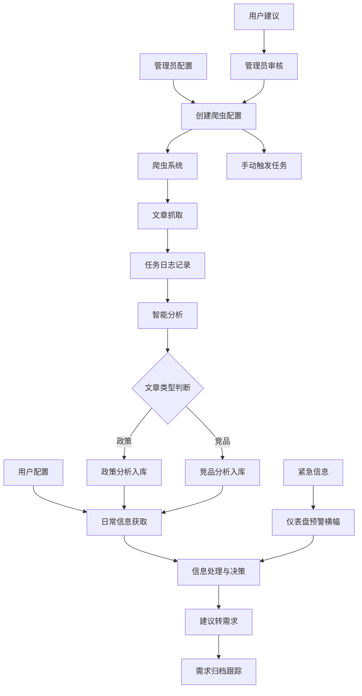

# 金融资讯智能跟踪平台-业务需求分析书

## 一、项目背景
- **目标用户**：银行产品经理
- **核心痛点**：
  1. 监管政策解读滞后，人工搜集效率低
  2. 竞品动态依赖碎片化监测，缺乏系统化分析
  3. 信息源配置复杂，缺乏多样化的外部渠道
- **产品理念**：「精准抓取+智能解读+协同闭环」，将成为产品经理的「决策外脑」。最关键的是避免成为「信息垃圾桶」——宁可少而精，不可多而杂。

## 二、需求范围（MVP版本）

| 模块 | 功能描述 | 优先级 | 实现状态 |
|------|----------|--------|----------|
| 监管政策监控 | 实时抓取央行/银保监会等权威渠道，智能解读影响 | P0 | ✅ 已实现 |
| 竞品动态追踪 | 监控同业产品发布、营销活动、财报关键数据 | P0 | ✅ 已实现 |
| 需求池管理 | 需求CRUD、状态管理、优先级管理、建议转需求 | P1 | ✅ 已实现 |
| 仪表盘 | 统计数据、摘要展示、卡片视图、快速入口 | P1 | ✅ 已实现 |
| 基础功能 | 用户自定义规则设置、摘要生成、重要性标记 | P1 | ✅ 已实现 |
| 爬虫管理 | 配置管理、任务监控、智能分析、用户建议处理 | P1 | ✅ 已实现 |
| 任务日志 | 任务执行日志查询、状态筛选、详情查看 | P1 | ✅ 已实现 |
| 订阅管理 | 基础订阅/取消订阅、信息源管理 | P1 | ✅ 已实现 |
| 设置中心 | 产品管理、推送设置配置 | P1 | ✅ 已实现 |
| 推送通知 | 站内信息中心推送 | P2 | ⚠️ 部分实现 |
| 微信推送 | 紧急预警微信推送 | P2 | 📋 未来计划 |
| 高级订阅功能 | 预设包、公众号、RSSHub、质量评分、相似合并 | P2 | 📋 未来计划 |
| 可视化配置工具 | 网页区域选择器、图像分析辅助 | P2 | 📋 未来计划 |

## 三、核心用户场景

### 1. 用户配置场景
**用户目标**：快速设置个性化监控方案
- 首次登录进入设置中心
- 从系统提供的信息源列表中，勾选关注的监管政策领域/来源（如信贷政策、数据安全等）
- 从系统提供的信息源列表中，选择需要关注的竞品机构/来源
- 上传自己负责的产品信息（以便获得更精准的分析）
- 设置个性化的信息推送方式和频率
- 用户可建议添加新的信息来源（如特定网址或竞品名称），提交后由管理员评估和配置

### 2. 日常信息获取场景
**用户目标**：高效获取关键信息，无需大量筛选
- 登录系统查看仪表盘，获取今日摘要
- 查看信息卡片（按重要性排序）
- 每张卡片显示：标题和来源、2-3条核心建议点、每条建议配有简短原因说明
- 点击卡片进入详情页，查看高亮原文
- 通过筛选功能快速定位感兴趣的内容

### 3. 建议转需求场景
**用户目标**：将有价值的分析直接转化为行动
- 在详情页点击"转为需求"按钮
- 系统自动填充需求模板（背景、建议内容、影响范围）
- 补充完善需求内容（优先级、计划实施时间等）
- 提交后，需求自动归档并可分享给团队
- 在需求池中跟踪需求处理状态

### 4. 紧急预警场景
**用户目标**：及时响应重大政策变化
- 在仪表盘查看紧急预警横幅
- 直接进入详情页查看高亮原文和初步分析
- 快速评估影响并采取行动
- 将重要信息快速转化为需求

### 5. 管理员配置场景
**用户目标**：管理和监控爬虫系统
- 在爬虫管理页面创建新的爬虫配置
- 选择提取策略（CSS选择器或LLM智能提取）
- 配置爬取目标和触发计划
- 手动触发爬虫任务
- 查看任务执行日志和分析结果
- 处理用户提交的新信息源建议
- 执行智能分析或再分析操作

## 四、详细需求说明

### 1. 监管政策模块 ✅
#### 数据源要求
- **官方渠道**：央行/银保监会官网、国务院金融委文件
- **地方政策**：各省市金融监管局通知（可按区域订阅）

#### 功能需求
- `FD-001` 政策分类标签化
  - 简化自动标签体系（重要/一般两级分类）
  - 支持用户自定义关注领域
  - 支持按重要度、相关度筛选
- `FD-002` 影响分析建议
  - 提供"建议点+原因"的标准输出格式
  - 自动关联行内产品（如「互联网贷款新规」→ 影响消费贷产品）
  - 支持查看原文并智能高亮关键条款
- `FD-003` 政策转需求
  - 一键将政策分析转化为产品需求
  - 自动记录来源和转化关系

### 2. 竞品动态模块 ✅
#### 监控对象
- **银行同业**：国有大行、股份制银行、主要城市商业银行、互联网银行等
- **非银机构**：蚂蚁/腾讯金融、持牌消金公司

#### 功能需求
- `CD-001` 产品更新捕获
  - 识别竞品APP更新日志、官网公告（如信用卡权益调整）
  - 支持按公司、动态类型筛选
- `CD-002` 自动生成分析摘要
  - 仅聚焦关键变化，以"建议点+原因"格式输出
  - 每个建议点限制在100字以内，确保简洁明了
- `CD-003` 竞品分析关键点提取
  - 重点关注：产品创新点、商业模式变化、用户体验改进
  - 原文智能高亮功能，标识关键内容
  - 提供市场影响分析和竞争态势分析
- `CD-004` 竞品转需求
  - 一键将竞品分析转化为产品需求
  - 自动记录来源和转化关系

### 3. 需求池管理模块 ✅
#### 功能需求
- `RM-001` 需求CRUD
  - 创建、编辑、删除需求
  - 需求详情查看
- `RM-002` 需求状态管理
  - 支持状态：新建、处理中、已完成、已拒绝
  - 状态流转和跟踪
- `RM-003` 需求优先级管理
  - 支持优先级：高、中、低
  - 按优先级排序和筛选
- `RM-004` 需求来源追踪
  - 记录需求来源（政策/竞品/手动）
  - 可追溯至原始文章

### 4. 仪表盘模块 ✅
#### 功能需求
- `DB-001` 统计数据展示
  - 政策、竞品、需求的数量统计
  - 趋势图表展示
- `DB-002` 摘要卡片
  - 最新政策提醒卡片
  - 最新竞品动态卡片
  - 待处理需求概览卡片
- `DB-003` 快速入口
  - 各功能模块的快速访问入口

### 5. 爬虫管理模块 ✅（管理员）
#### 功能需求
- `CM-001` 配置管理
  - 创建、编辑、删除爬虫配置
  - 启用/禁用配置
  - 支持双爬虫服务：传统爬虫和EagleEye爬虫
- `CM-002` 策略选择
  - CSS选择器提取策略
  - LLM智能提取策略（支持自定义Schema和指令）
- `CM-003` 任务监控
  - 手动触发单次爬取任务
  - 查看任务执行状态（进行中/已完成/失败）
  - 查看文章数量和分类统计
- `CM-004` 智能分析
  - 自动识别文章类型（政策/竞品）
  - 调用对应的分析器进行处理
- `CM-005` 再分析
  - 删除旧记录后重新分析
  - 支持分析策略调整后重新处理
- `CM-006` 再爬取
  - 基于原任务重新爬取更新内容
  - 更新原任务而非创建新任务
- `CM-007` 用户建议处理
  - 查看用户提交的新信息源建议
  - 采纳后自动跳转到配置页面并预填充数据

### 6. 任务日志管理模块 ✅（管理员）
#### 功能需求
- `TL-001` 日志查询
  - 分页查询爬虫任务执行日志
  - 查看任务执行时间、状态、文章数量
- `TL-002` 状态筛选
  - 按状态、配置ID、时间范围筛选
  - 支持查看失败任务的错误信息
- `TL-003` 详情查看
  - 查看任务分析结果
  - 查看分类统计和政策/竞品分布
- `TL-004` 分析操作
  - 触发政策文章分析入库
  - 触发竞品文章分析入库
  - 执行智能分析或再分析

### 7. 订阅管理模块 ✅
#### 功能需求
- `SM-001` 信息源订阅
  - 获取可订阅的信息源列表
  - 订阅/取消订阅信息源
  - 更新订阅设置
- `SM-002` 我的订阅
  - 查看我的订阅列表
  - 管理订阅优先级
- `SM-003` 用户建议
  - 提交新信息源建议
  - 跟踪建议处理状态

### 8. 设置中心模块 ✅
#### 功能需求
- `ST-001` 产品管理
  - 添加、编辑、删除产品信息
  - 用于获得更精准的分析
- `ST-002` 推送设置
  - 配置推送频率
  - 选择推送渠道（站内/微信）

### 9. 基础功能 ✅
- `BF-001` 用户自定义配置关注信息
  - 用户可从系统提供的、由管理员预先配置并维护的信息源列表中，选择（订阅/取消订阅）自己关注的政策领域和竞品动态来源（例如「仅接收小微企业信贷政策」或关注"XX银行信用卡动态"）
  - 用户的关注范围（订阅状态）将影响其接收的信息推送和仪表盘等处显示的内容
  - 系统应提供机制，允许用户提交希望监控的新信息源建议，供管理员审核和配置
  - 可以上传自己的产品信息，以便获得更有针对性的解读和分析
- `BF-002` 信息展示与推送机制
  - 两层信息结构：精简卡片（核心建议）→ 详情页（高亮原文）
  - 推送分级：站内信息中心（已实现）、微信推送（未来计划）
  - 支持按重要性筛选文章（高/中/低）
- `BF-003` 建议转需求功能
  - 一键将分析建议转为产品需求条目
  - 自动记录来源和转化关系

## 五、系统流程设计

## 六、界面设计原则
1. **简约界面**：每个页面聚焦单一功能，减少无关元素
2. **决策优先**：内容展示以"需要做什么"为导向，而非信息堆砌
3. **一键操作**：关键流程（如转需求、订阅设置）控制在3步以内完成
4. **智能筛选**：系统自动过滤低价值信息，确保呈现内容质量
5. **用户与管理分离**：普通用户专注于内容价值，管理员负责技术配置

## 七、非功能性需求
| 类型 | 要求 |
|------|------|
| 数据时效性 | 政策类信息延迟≤15分钟，竞品动态≤1小时 |
| 安全性 | 敏感信息加密传输，支持私有化部署 |
| 性能 | 支持并发用户≥500人，响应时间<2秒 |
| 信息质量 | 设置严格的信息质量门槛，宁可少报不可误报 |
| 扩展性 | 支持双爬虫服务架构，支持快速集成新的信息源和内容处理方式 |
| 可维护性 | 完整的任务日志记录，支持问题排查和性能分析 |

## 八、成功指标
- **建议采纳转化率** ≥20%（信息实际被转化为产品需求的比例）
- **用户订阅配置时间** ≤5分钟（新用户完成初始订阅设置的平均时间）
- **有效信息覆盖率** ≥90%（系统捕获的关键信息占行业总体关键信息的比例）
- **爬取任务成功率** ≥95%（爬虫任务成功执行的比例）
- **分析任务完成率** ≥90%（分析任务成功完成并入库的比例）
- **用户建议处理时效** ≤3个工作日（用户提交建议到处理完成的时间）

## 九、技术实现亮点

### 1. 双爬虫服务架构
- **传统爬虫服务**：基于成熟爬虫框架，处理结构化数据
- **EagleEye爬虫服务**：基于FastAPI代理，集成Claude Code Skills，处理复杂网页

### 2. 智能分析机制
- 自动识别文章类型（政策/竞品）
- 调用对应的分析器进行深度分析
- 支持自定义LLM配置和提取指令

### 3. 任务管理优化
- **再分析功能**：删除旧记录后重新分析，支持策略迭代
- **再爬取功能**：基于原任务重新爬取，避免重复配置
- **任务状态轮询**：前端自动轮询分析状态，完成后通知用户

### 4. 用户建议审核工作流
- 用户提交新信息源建议
- 管理员审核后采纳
- 自动跳转到配置页面并预填充数据
- 提升管理员操作效率

### 5. 数据分析支持
- 文章数统计和分类统计（categoryStats字段）
- 支持按政策领域、竞品公司、动态类型等多维度分析
- 为产品决策提供数据支持

## 十、未来计划

### 1. 高级订阅功能 📋
- **预设订阅包**：根据用户角色和业务场景，提供预设的订阅包，支持一键订阅
- **微信公众号集成**：搜索和添加金融相关公众号，提供热门推荐
- **RSSHub源集成**：精选优质金融信息源，一键添加
- **AI内容质量评分**：对每条内容进行质量评分，过滤低质量内容
- **重要性自动分级**：自动将内容分为"必读"和"参考"两级
- **相似内容合并**：检测并合并重复或高度相似的内容

### 2. 可视化配置工具 📋
- **网页区域选择器**：提供直观界面让管理员框选目标区域
- **图像分析辅助**：利用多模态LLM分析所选区域内容
- **配置测试功能**：实时测试配置有效性，预览爬取结果
- **HTML处理优化**：预处理HTML减少LLM处理成本

### 3. 推送增强 📋
- **微信推送集成**：紧急预警通过微信推送，提升及时性
- **推送策略优化**：根据用户行为和偏好优化推送频率和内容
- **用户反馈机制**：收集用户对推送内容的"有用/无用"反馈，优化推荐算法

### 4. 用户体验优化 📋
- **订阅源预览**：预览订阅源的最新内容样例
- **个性化推荐**：基于用户行为和偏好，推荐相关内容
- **智能摘要**：自动生成更精准的内容摘要
