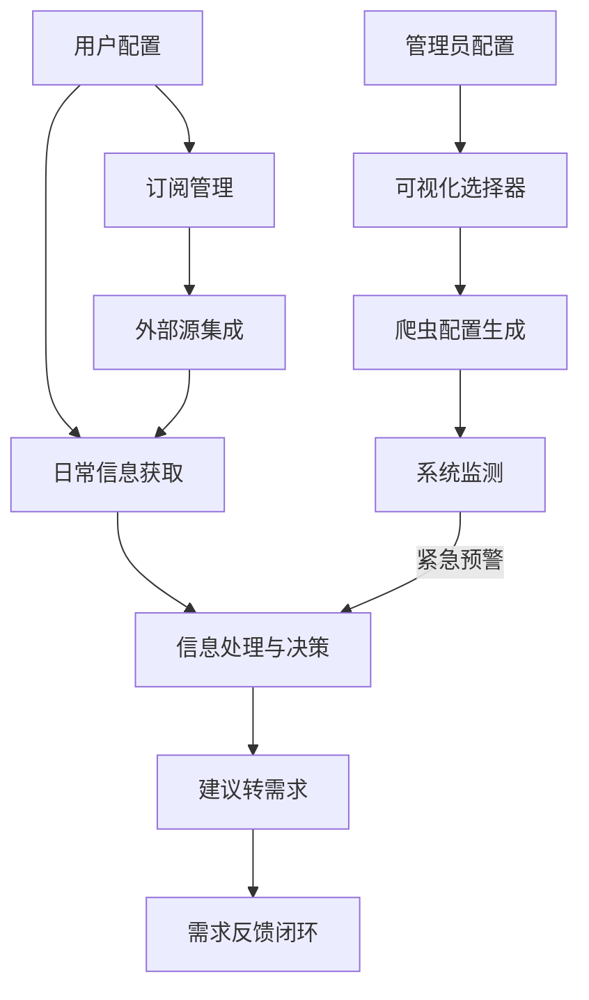

# 金融资讯智能跟踪平台-业务需求分析书

## 一、项目背景
- **目标用户**：银行产品经理  
- **核心痛点**：  
  1. 监管政策解读滞后，人工搜集效率低  
  2. 竞品动态依赖碎片化监测，缺乏系统化分析 
  3. **信息源单一且配置复杂**，缺乏微信公众号等重要渠道
- **产品理念**：「精准抓取+智能解读+协同闭环」，将成为产品经理的「决策外脑」。最关键的是避免成为「信息垃圾桶」——宁可少而精，不可多而杂。

## 二、需求范围（MVP版本）
| 模块          | 功能描述                              | 优先级 |
|---------------|-------------------------------------|--------|
| 监管政策监控  | 实时抓取央行/银保监会等权威渠道，智能解读影响 | P0     |
| 竞品动态追踪  | 监控同业产品发布、营销活动、财报关键数据    | P0     |
| 基础功能      | 用户自定义规则设置、摘要生成、建议转需求    | P1     |
| **订阅管理**  | **简化订阅配置、预设包功能、外部源集成**   | **P1** |
| **爬虫配置**  | **可视化选择器、配置测试、内容质量评估**   | **P2** |

## 三、核心用户场景

### 1. 用户配置场景
**用户目标**：快速设置个性化监控方案
- 首次登录进入"我的关注"配置页面
- 从**系统提供的信息源列表**中，勾选关注的监管政策领域/来源（如信贷政策、数据安全等）
- 从**系统提供的信息源列表**中，选择需要关注的竞品机构/来源
- **选择推荐的预设订阅包，快速完成初始配置**
- **添加感兴趣的外部RSS源和微信公众号**
- 上传自己负责的产品信息（以便获得更精准的分析）
- 设置个性化的信息推送方式和频率
- **(新增)** 用户可**建议添加**新的信息来源（如特定网址或竞品名称），提交后由管理员评估和配置

### 2. 日常信息获取场景
**用户目标**：高效获取关键信息，无需大量筛选
- 收到系统推送的今日摘要通知

- 查看信息卡片（按重要性排序）
- 每张卡片显示：标题和来源、2-3条核心建议点、每条建议配有简短原因说明
- 点击卡片进入详情页，查看高亮原文
- 对建议进行"有用/无用"反馈

### 3. 建议转需求场景
**用户目标**：将有价值的分析直接转化为行动
- 在详情页点击"转为需求"按钮
- 系统自动填充需求模板（背景、建议内容、影响范围）
- 补充完善需求内容（优先级、计划实施时间等）
- 提交后，需求自动归档并可分享给团队

### 4. 紧急预警场景
**用户目标**：及时响应重大政策变化
- 收到系统紧急微信推送
- 直接进入详情页查看高亮原文和初步分析
- 快速评估影响并采取行动

### 5. **订阅管理场景** (新增)
**用户目标**：便捷管理个性化的信息来源
- 通过"一键订阅"功能选择推荐的预设订阅包
- 浏览并选择金融行业热门微信公众号
- 添加RSSHub中的优质金融信息源
- 一站式管理所有订阅源（添加/删除/调整优先级）
- 预览订阅源的最新内容样例

## 四、详细需求说明
### 1. 监管政策模块
#### 数据源要求
- **官方渠道**：央行/银保监会官网、国务院金融委文件  
- **地方政策**：各省市金融监管局通知（可按区域订阅）  

#### 功能需求
- `FD-001` 政策分类标签化  
  - 简化自动标签体系（限制为重要/一般两级分类）  
  - 支持用户自定义关注领域  
- `FD-002` 影响分析建议  
  - 提供"建议点+原因"的标准输出格式
  - 自动关联行内产品（如「互联网贷款新规」→ 影响消费贷产品）
  - 支持查看原文并智能高亮关键条款

### 2. 竞品动态模块
#### 监控对象
- **银行同业**：国有大行、股份制银行、主要城市商业银行、互联网银行等  
- **非银机构**：蚂蚁/腾讯金融、持牌消金公司  

#### 功能需求
- `CD-001` 产品更新捕获  
  - 识别竞品APP更新日志、官网公告（如信用卡权益调整）  
- `CD-002` 自动生成分析摘要  
  - 仅聚焦关键变化，以"建议点+原因"格式输出
  - 每个建议点限制在100字以内，确保简洁明了
- `CD-003` 竞品分析关键点提取
  - 重点关注：产品创新点、商业模式变化、用户体验改进
  - 原文智能高亮功能，标识关键内容

### 3. 基础功能
- `BF-001` 用户自定义配置关注信息  
  - 用户可从系统提供的、由**管理员预先配置并维护**的信息源列表中，选择（订阅/取消订阅）自己关注的政策领域和竞品动态来源（例如「仅接收小微企业信贷政策」或关注"XX银行信用卡动态"）。
  - 用户的关注范围（订阅状态）将影响其接收的信息推送和仪表盘等处显示的内容。
  - 系统应提供机制，允许用户提交希望监控的新信息源建议，供管理员审核和配置。
  - 可以上传自己的产品信息，以便获得更有针对性的解读和分析。
- `BF-002` 信息展示与推送机制  
  - 两层信息结构：精简卡片（核心建议）→ 详情页（高亮原文）
  - 推送分级：紧急（微信推送）、一般（站内信息中心）
- `BF-003` 建议转需求功能
  - 一键将分析建议转为产品需求条目
  - 自动记录采纳情况和转化率
  - 建立基础反馈闭环机制，优化后续推荐

### 4. **订阅管理功能** (新增)
#### 订阅机制设计
- `SM-001` 预设订阅包
  - 根据用户角色和业务场景，提供预设的订阅包
  - 支持一键订阅全部推荐源
  - 提供行业分类和热门推荐排序
- `SM-002` 微信公众号集成
  - 支持搜索和添加金融相关公众号
  - 提供热门金融公众号推荐列表
  - 支持批量导入功能
- `SM-003` RSSHub源集成
  - 精选与金融相关的优质RSSHub源
  - 一键添加功能
  - 支持用户添加自定义RSS源

#### 内容筛选机制
- `SM-004` AI内容质量评分
  - 对获取的每条内容进行质量评分
  - 过滤低质量内容，确保信息"少而精"
- `SM-005` 重要性自动分级
  - 将内容分为"必读"和"参考"两级
  - 支持用户调整特定源的重要性权重
- `SM-006` 相似内容合并
  - 检测并合并重复或高度相似的内容，减少信息冗余

### 5. **爬虫配置工具** (新增)
#### 可视化选择功能
- `CT-001` 网页区域选择器
  - 提供直观的界面让管理员框选目标区域
  - 支持多区域选择和分类标记
- `CT-002` 图像分析辅助
  - 利用多模态LLM分析所选区域内容
  - 自动生成区域结构化描述
- `CT-003` 配置测试功能
  - 实时测试配置的有效性
  - 预览爬取结果并支持快速调整
- `CT-004` HTML处理优化
  - 预处理HTML减少LLM处理成本
  - 将视觉区域映射到DOM元素

## 五、系统流程设计

## 六、界面设计原则
1. **简约界面**：每个页面聚焦单一功能，减少无关元素
2. **决策优先**：内容展示以"需要做什么"为导向，而非信息堆砌
3. **一键操作**：关键流程（如转需求、订阅设置）控制在3步以内完成
4. **智能筛选**：系统自动过滤低价值信息，确保呈现内容质量
5. **用户与管理分离**：普通用户专注于内容价值，管理员负责技术配置

## 七、非功能性需求
| 类型         | 要求                                                                 |
|--------------|----------------------------------------------------------------------|
| 数据时效性   | 政策类信息延迟≤15分钟，竞品动态≤1小时                                |
| 安全性       | 敏感信息加密传输，支持私有化部署                                      |
| 性能         | 支持并发用户≥500人，响应时间<2秒                                     |
| 信息质量     | 设置严格的信息质量门槛，宁可少报不可误报                              |
| **扩展性**   | **支持快速集成新的信息源和内容处理方式**                               |

## 八、成功指标
- **建议采纳转化率** ≥20%（信息实际被转化为产品需求的比例）
- **用户订阅配置时间** ≤5分钟（新用户完成初始订阅设置的平均时间）
- **有效信息覆盖率** ≥90%（系统捕获的关键信息占行业总体关键信息的比例）
- **信息筛选有效率** ≥80%（用户标记为"有用"的信息占推送总量的比例）