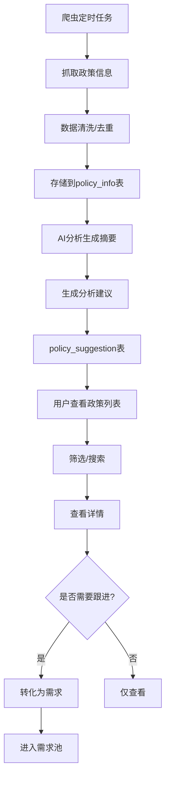
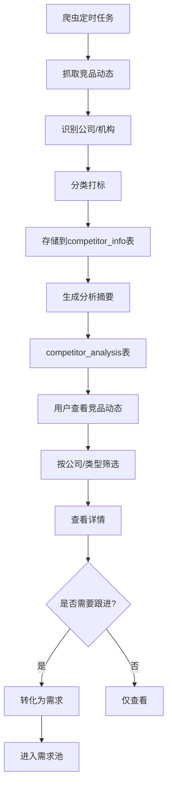
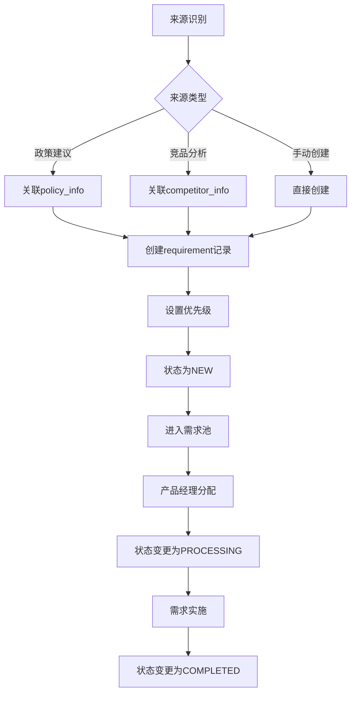
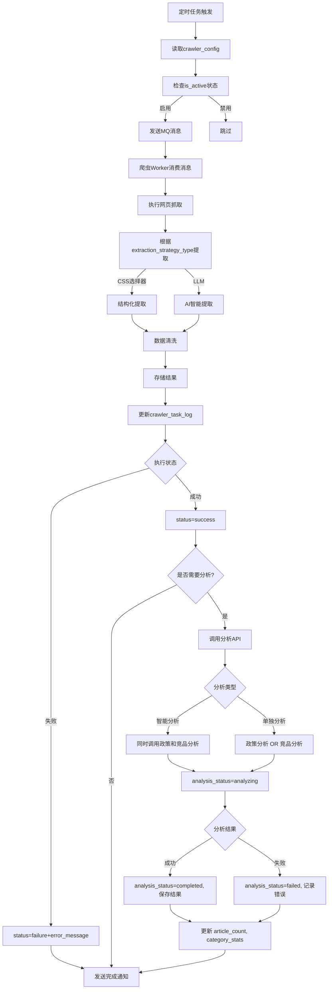

# EagleEye2 软件设计书

## 文档信息

| 项目 | 内容 |
|------|------|
| 项目名称 | EagleEye2 金融资讯智能跟踪平台 |
| 文档版本 | 2.0 |
| 创建日期 | 2025-12-27 |
| 更新日期 | 2026-01-03 |
| 文档类型 | 软件设计书（基于代码反向更新） |
| 更新说明 | 对齐代码实现：新增任务监控模块、扩展数据库字段、修正 API 路径、新增前端组件 |

---

## 1. 项目概述

### 1.1 项目简介

EagleEye2 是一个面向金融行业的资讯智能跟踪平台，旨在帮助产品经理和业务人员实时监控监管政策动态、追踪竞品产品发布与营销活动，并将有价值的分析建议转化为产品需求，从而提升产品迭代效率和市场竞争力。

### 1.2 核心价值

- **政策监控**：实时抓取央行、银保监会等权威渠道的政策信息，支持关键词搜索和分类筛选
- **竞品追踪**：监控同业产品发布、营销活动、财报数据等动态，提供多维度分析
- **需求转化**：将政策建议和竞品分析一键转化为产品需求，形成需求池统一管理
- **智能推送**：根据用户偏好自动推送相关资讯和预警信息

### 1.3 目标用户

- 金融产品经理
- 业务分析师
- 市场研究人员
- 产品运营人员

---

## 2. 系统架构

### 2.1 架构概览

```
┌─────────────────────────────────────────────────────────────────┐
│                         用户层                                   │
│  Web浏览器 (Vue3 + TypeScript + Element Plus)                   │
└─────────────────────────────────────────────────────────────────┘
                                  │
                         ┌────────▼────────┐
                         │   API Gateway   │
                         │   (端口: 9090)   │
                         └────────┬────────┘
                                  │
┌─────────────────────────────────────────────────────────────────┐
│                        应用层 (Spring Boot)                      │
├──────────────┬──────────────┬──────────────┬───────────────────┤
│  政策监控模块  │  竞品追踪模块  │  需求管理模块  │   爬虫管理模块     │
│ PolicyService│CompetitorSvc │RequirementSvc│ CrawlerAdminSvc   │
└──────────────┴──────────────┴──────────────┴───────────────────┘
                                  │
┌─────────────────────────────────────────────────────────────────┐
│                        服务层                                    │
├──────────────┬──────────────┬───────────────────────────────────┤
│   数据访问    │    缓存      │         消息队列                  │
│ MyBatis Plus │    Redis     │        RabbitMQ                   │
└──────────────┴──────────────┴───────────────────────────────────┘
                                  │
┌─────────────────────────────────────────────────────────────────┐
│                        数据层                                    │
│                    MySQL 8.0+                                   │
└─────────────────────────────────────────────────────────────────┘
```

### 2.2 技术栈

#### 后端技术栈

| 技术 | 版本 | 用途 |
|------|------|------|
| Java | 8+ | 开发语言 |
| Spring Boot | 2.7.17 | 应用框架 |
| MyBatis Plus | 3.5.3 | ORM框架 |
| Spring Security | - | 安全认证 |
| MySQL | 8.0+ | 关系数据库 |
| Redis | - | 缓存/会话 |
| RabbitMQ | - | 消息队列 |
| Knife4j | - | API文档 |

#### 前端技术栈

| 技术 | 版本 | 用途 |
|------|------|------|
| Vue | 3.3.4 | 前端框架 |
| TypeScript | 5.2.2 | 类型系统 |
| Element Plus | 2.4.4 | UI组件库 |
| Vite | 4.5.0 | 构建工具 |
| Pinia | 2.1.7 | 状态管理 |
| Vue Router | 4.2.5 | 路由管理 |
| Axios | 1.6.0 | HTTP客户端 |
| ECharts | 5.4.3 | 图表库 |
| Tailwind CSS | - | CSS框架 |

---

## 3. 数据库设计

### 3.1 数据库概览

- **数据库名**: `eagleeye`
- **字符集**: `utf8mb4`
- **命名规范**: snake_case

### 3.2 核心数据表

#### 3.2.1 用户相关表

| 表名 | 说明 | 关键字段 |
|------|------|----------|
| `user` | 用户表 | id, username, password, nickname, email, phone, status |
| `user_preference` | 用户偏好表 | user_id, policy_areas, competitor_ids, push_config |
| `user_settings` | 用户设置表 | user_id, frequency, channels |
| `user_product` | 用户产品表 | user_id, name, type, features |

#### 3.2.2 政策监控表

| 表名 | 说明 | 关键字段 |
|------|------|----------|
| `policy_info` | 政策信息表 | id, title, source, source_url, publish_time, content, policy_type, importance, relevance, areas |
| `policy_analysis` | 政策分析表 | policy_id, summary, key_points, impact_analysis, relevance |
| `policy_suggestion` | 政策建议表 | policy_id, analysis_id, suggestion, reason |

**关键字段补充说明：**

| 字段名 | 类型 | 说明 |
|--------|------|------|
| `relevance` | VARCHAR(16) | 与产品的相关度：高\|中\|低 |

#### 3.2.3 竞品分析表

| 表名 | 说明 | 关键字段 |
|------|------|----------|
| `competitor_info` | 竞品信息表 | id, title, company, type, capture_time, tags, content, sources, summary, importance, relevance, key_points, market_impact |
| `competitor_analysis` | 竞品分析建议表 | competitor_id, content, sort_order, importance, relevance, key_points, market_impact, competitive_analysis, our_suggestions |
| `competitor_source` | 竞品资源链接表 | competitor_id, title, url, sort_order |
| `competitor_tag` | 竞品标签表 | competitor_id, label, color |

**关键字段补充说明：**

| 字段名 | 类型 | 说明 |
|--------|------|------|
| `importance` | VARCHAR(16) | 重要程度：高\|中\|低 |
| `relevance` | VARCHAR(16) | 与我方产品的相关度：高\|中\|低 |
| `key_points` | JSON | 关键要点（用于详情页高亮） |
| `market_impact` | TEXT | 市场影响分析 |
| `competitive_analysis` | TEXT | 竞争态势分析 |
| `our_suggestions` | JSON | 针对性建议列表 |

#### 3.2.4 需求管理表

| 表名 | 说明 | 关键字段 |
|------|------|----------|
| `requirement` | 需求表 | id, title, description, background, priority, status, source_type, source_id, user_id |

#### 3.2.5 爬虫管理表

| 表名 | 说明 | 关键字段 |
|------|------|----------|
| `crawler_config` | 爬虫配置表 | config_id, target_name, target_type, source_urls, crawl_depth, trigger_schedule, extraction_strategy_type, crawler_service, result_path |
| `crawler_task_log` | 爬虫任务执行日志表 | log_id, task_id, config_id, target_url, start_time, end_time, status, error_message, batch_path, article_count, category_stats, analysis_status, analysis_result |
| `user_source_subscription` | 用户信息源订阅表 | subscription_id, user_id, config_id, subscription_status, notification_preference |
| `user_suggestion` | 用户建议表 | id, user_id, suggestion_type, source_name, suggestion_content, status |

**关键字段补充说明：**

| 字段名 | 类型 | 说明 |
|--------|------|------|
| `crawler_service` | VARCHAR(50) | 爬虫服务类型：legacy（传统）/eagleeye（新服务） |
| `result_path` | VARCHAR(500) | 最新爬取结果文件夹路径 |
| `batch_path` | VARCHAR(500) | 批次文件夹路径（如：crawl_files/20251228_100307_eastmoney_bank） |
| `article_count` | INT | 本次爬取的文章数量 |
| `category_stats` | VARCHAR(200) | 分类统计 JSON：{"policy":2,"competitor":1} |
| `analysis_status` | VARCHAR(32) | 分析状态：pending/analyzing/completed/failed |
| `analysis_result` | JSON | 分析结果：{"total":5,"success":3,"skipped":1,"failed":1} |

### 3.3 数据关系图

```
user (1) ──┬──> (N) user_preference
           ├──> (N) user_settings
           ├──> (N) user_product
           └──> (N) user_source_subscription ──> (N) crawler_config
                                                    │
                                                    └──> (N) crawler_task_log

policy_info (1) ──┬──> (N) policy_analysis
                  └──> (N) policy_suggestion

competitor_info (1) ──┬──> (N) competitor_analysis
                      ├──> (N) competitor_source
                      └──> (N) competitor_tag

requirement (N) <─── (1) user
requirement.source_type + source_id ──> policy_info / competitor_info
```

### 3.4 公共字段规范

所有业务表包含以下公共字段：

| 字段名 | 类型 | 说明 |
|--------|------|------|
| `id` | BIGINT | 主键ID，自增 |
| `is_deleted` | TINYINT(1) | 逻辑删除标志：0-未删除，1-已删除 |
| `create_time` | DATETIME | 创建时间 |
| `update_time` | DATETIME | 更新时间 |

---

## 4. 接口设计

### 4.1 API规范

- **基础路径**: `/api`
- **响应格式**: 统一使用 `CommonResult` 包装
- **版本管理**: URL路径版本控制 (`/v1/`)
- **API文档**: Knife4j (http://localhost:9090/api/doc.html)

### 4.2 响应格式

```json
{
  "code": 200,
  "message": "success",
  "data": {}
}
```

### 4.3 核心API列表

#### 4.3.1 政策监控模块 (`/v1/policies`)

| 方法 | 路径 | 说明 |
|------|------|------|
| GET | `/v1/policies` | 获取政策列表（分页、筛选） |
| GET | `/v1/policies/{id}` | 获取政策详情 |
| POST | `/v1/policies/{id}/to-requirement` | 将政策转化为需求 |

#### 4.3.2 竞品追踪模块 (`/v1/competitors`)

| 方法 | 路径 | 说明 |
|------|------|------|
| GET | `/v1/competitors` | 获取竞品动态列表（分页、筛选） |
| GET | `/v1/competitors/{id}` | 获取竞品详情 |
| POST | `/v1/competitors/{id}/to-requirement` | 将竞品动态转化为需求 |

#### 4.3.3 需求管理模块 (`/v1/requirements`)

| 方法 | 路径 | 说明 |
|------|------|------|
| GET | `/v1/requirements` | 获取需求列表（分页、筛选） |
| GET | `/v1/requirements/{id}` | 获取需求详情 |
| POST | `/v1/requirements` | 创建需求 |
| PUT | `/v1/requirements/{id}` | 更新需求 |
| DELETE | `/v1/requirements/{id}` | 删除需求 |
| POST | `/v1/requirements/policy/{policyId}/to-requirement` | 政策转需求 |
| POST | `/v1/requirements/competitor/{competitorId}/to-requirement` | 竞品转需求 |

#### 4.3.4 仪表盘模块 (`/v1/dashboard`)

| 方法 | 路径 | 说明 |
|------|------|------|
| GET | `/v1/dashboard/stats` | 获取仪表盘统计数据 |
| GET | `/v1/dashboard/policy-summary` | 获取政策摘要 |
| GET | `/v1/dashboard/competitor-summary` | 获取竞品摘要 |
| GET | `/v1/dashboard/requirement-summary` | 获取需求摘要 |

#### 4.3.5 爬虫管理模块 (管理员)

**配置管理 API：**

| 方法 | 路径 | 说明 |
|------|------|------|
| POST | `/v1/admin/crawler/configs` | 创建爬虫配置 |
| GET | `/v1/admin/crawler/configs` | 获取爬虫配置列表 |
| GET | `/v1/admin/crawler/configs/{configId}` | 获取爬虫配置详情 |
| PUT | `/v1/admin/crawler/configs/{configId}` | 更新爬虫配置 |
| DELETE | `/v1/admin/crawler/configs/{configId}` | 删除爬虫配置 |
| PATCH | `/v1/admin/crawler/configs/{configId}/status` | 更新爬虫状态 |
| POST | `/v1/admin/crawler/configs/{configId}/trigger` | 手动触发爬虫任务 |

**任务监控 API：**

| 方法 | 路径 | 说明 |
|------|------|------|
| GET | `/v1/admin/crawler/tasks` | 分页查询任务日志（支持状态/配置ID/时间筛选） |
| GET | `/v1/admin/crawler/tasks/{taskId}/status` | 查询任务状态 |
| POST | `/v1/admin/crawler/tasks/{taskId}/analyze-policies` | 触发政策文章分析入库 |
| POST | `/v1/admin/crawler/tasks/{taskId}/analyze-competitors` | 触发竞品文章分析入库 |
| POST | `/v1/admin/crawler/tasks/{taskId}/analyze` | 智能分析（自动判断类型） |
| POST | `/v1/admin/crawler/tasks/{taskId}/re-analyze` | 再分析（删除旧记录后重新分析） |
| POST | `/v1/admin/crawler/tasks/{taskId}/re-crawl` | 重新爬取 |
| GET | `/v1/admin/crawler/tasks/{taskId}/analysis-results` | 获取分析结果 |

#### 4.3.6 用户订阅模块

| 方法 | 路径 | 说明 |
|------|------|------|
| GET | `/v1/crawler/subscriptions/available` | 获取可订阅的信息源列表 |
| GET | `/v1/crawler/subscriptions` | 获取我的订阅列表 |
| POST | `/v1/crawler/subscriptions` | 创建订阅 |
| PUT | `/v1/crawler/subscriptions/{subscriptionId}` | 更新订阅设置 |
| DELETE | `/v1/crawler/subscriptions/{subscriptionId}` | 取消订阅 |

#### 4.3.7 系统设置模块

| 方法 | 路径 | 说明 |
|------|------|------|
| GET | `/v1/settings/all` | 获取所有设置数据 |
| GET | `/v1/settings/products` | 获取用户产品列表 |
| POST | `/v1/settings/products` | 添加用户产品 |
| PUT | `/v1/settings/products/{productId}` | 更新用户产品 |
| DELETE | `/v1/settings/products/{productId}` | 删除用户产品 |
| POST | `/v1/settings/push` | 保存推送设置 |

---

## 5. 核心业务流程

### 5.1 政策监控流程



### 5.2 竞品追踪流程



### 5.3 需求转化流程



### 5.4 爬虫任务执行流程



---

## 6. 前端设计

### 6.1 页面结构

| 路由路径 | 页面名称 | 组件路径 |
|----------|----------|----------|
| `/` | 仪表盘 | `pages/Dashboard.vue` |
| `/policy-monitoring` | 政策监控 | `pages/policy/PolicyMonitoringPage.vue` |
| `/policy-detail/:id` | 政策详情 | `pages/policy/PolicyDetailPage.vue` |
| `/competitor-tracking` | 竞品追踪 | `pages/competitor/CompetitorTrackingPage.vue` |
| `/competitor-detail/:id` | 竞品详情 | `pages/competitor/CompetitorDetailPage.vue` |
| `/requirement-pool` | 需求池 | `pages/requirement/RequirementPoolPage.vue` |
| `/requirement-detail/:id` | 需求详情 | `pages/requirement/RequirementDetailPage.vue` |
| `/requirement-add` | 新增需求 | `pages/requirement/RequirementAddPage.vue` |
| `/requirement-edit/:id` | 编辑需求 | `pages/requirement/RequirementEditPage.vue` |
| `/settings` | 设置中心 | `pages/settings/SettingsPage.vue` |
| `/admin/crawler` | 爬虫管理 | `pages/admin/crawler/index.vue` |

### 6.2 组件分类

#### 6.2.1 通用组件 (`components/common/`)

- `NavBar.vue` - 导航栏（菜单、用户信息、通知）
- `Footer.vue` - 页脚
- `AppLayout.vue` - 应用布局
- `Breadcrumb.vue` - 面包屑导航
- `AlertBanner.vue` - 紧急预警横幅
- `Card.vue` - 卡片组件
- `BaseModal.vue` - 基础弹窗

#### 6.2.2 仪表盘组件 (`components/dashboard/`)

- `PolicyCard.vue` - 政策卡片
- `CompetitorCard.vue` - 竞品卡片
- `RequirementCard.vue` - 需求卡片
- `TrendChart.vue` - 趋势图表（ECharts）
- `PieChart.vue` - 饼图（ECharts）

#### 6.2.3 政策组件 (`components/policy/`)

- `PolicyList.vue` - 政策列表
- `PolicyDetail.vue` - 政策详情
- `PolicyFilter.vue` - 政策筛选器

#### 6.2.4 竞品组件 (`components/competitor/`)

- `CompetitorList.vue` - 竞品列表
- `CompetitorDetail.vue` - 竞品详情
- `CompetitorFilter.vue` - 竞品筛选器

#### 6.2.5 需求组件 (`components/requirement/`)

- `RequirementTable.vue` - 需求表格
- `RequirementForm.vue` - 需求表单
- `RequirementDetail.vue` - 需求详情
- `StatusTag.vue` - 状态标签
- `PriorityTag.vue` - 优先级标签

#### 6.2.6 爬虫管理组件 (`components/admin/crawler/`)

- `ConfigTable.vue` - 配置列表表格
- `ConfigModal.vue` - 配置编辑弹窗
- `TaskTable.vue` - 任务列表表格
- `AnalysisResultsDrawer.vue` - 分析结果抽屉
- `StatusTag.vue` - 任务状态标签
- `TypeTag.vue` - 爬虫类型标签
- `StrategyTypeTag.vue` - 策略类型标签
- `SuggestionTable.vue` - 用户建议表格

### 6.3 状态管理

**Pinia 状态管理（规划中）：**

| Store | 状态 | 说明 |
|-------|------|------|
| `userStore` | 规划中 | 用户登录信息、权限 |
| `policyStore` | 规划中 | 政策筛选条件、缓存 |
| `competitorStore` | 规划中 | 竞品筛选条件、缓存 |
| `requirementStore` | 规划中 | 需求列表状态 |
| `settingsStore` | 规划中 | 用户设置 |

**当前实现方式：**
- 使用组件内响应式数据（ref、reactive）
- Props 和 Events 进行组件间通信
- Services 层处理业务逻辑

### 6.4 类型定义 (`src/types/`)

- `common.ts` - 通用类型（分页、API响应）
- `policy.ts` - 政策相关类型
- `competitor.ts` - 竞品相关类型
- `requirement.ts` - 需求相关类型
- `dashboard.ts` - 仪表盘相关类型
- `settings.ts` - 设置相关类型

---

## 7. 关键文件路径

### 7.1 后端关键文件

| 模块 | 文件路径 |
|------|----------|
| 政策控制器 | `src/main/java/com/eagleeye/controller/policy/PolicyController.java` |
| 竞品控制器 | `src/main/java/com/eagleeye/controller/competitor/CompetitorController.java` |
| 需求控制器 | `src/main/java/com/eagleeye/controller/requirement/RequirementController.java` |
| 仪表盘控制器 | `src/main/java/com/eagleeye/controller/dashboard/DashboardController.java` |
| 爬虫配置控制器 | `src/main/java/com/eagleeye/controller/crawler/CrawlerConfigAdminController.java` |
| 任务日志控制器 | `src/main/java/com/eagleeye/controller/crawler/CrawlerTaskLogController.java` |
| 用户订阅控制器 | `src/main/java/com/eagleeye/controller/crawler/UserSubscriptionController.java` |
| 设置控制器 | `src/main/java/com/eagleeye/controller/settings/SettingsController.java` |
| Spring Security配置 | `src/main/java/com/eagleeye/config/SecurityConfig.java` |
| 应用配置 | `src/main/resources/application.yml` |

### 7.2 前端关键文件

| 模块 | 文件路径 |
|------|----------|
| 应用入口 | `web/src/main.ts` |
| 路由配置 | `web/src/router/index.ts` |
| API请求配置 | `web/src/api/request.ts` |
| 仪表盘页面 | `web/src/pages/Dashboard.vue` |
| 政策监控页面 | `web/src/pages/policy/PolicyMonitoringPage.vue` |
| 竞品追踪页面 | `web/src/pages/competitor/CompetitorTrackingPage.vue` |
| 需求池页面 | `web/src/pages/requirement/RequirementPoolPage.vue` |
| 爬虫管理页面 | `web/src/pages/admin/crawler/index.vue` |
| 任务监控Tab | `web/src/pages/admin/crawler/TaskMonitoringTab.vue` |
| 任务表格组件 | `web/src/components/admin/crawler/TaskTable.vue` |
| 分析结果抽屉 | `web/src/components/admin/crawler/AnalysisResultsDrawer.vue` |
| 爬虫API | `web/src/api/admin/crawler.ts` |
| 设置API | `web/src/api/settings.ts` |

---

## 8. 部署架构

### 8.1 开发环境

```yaml
后端服务: localhost:9090
前端服务: localhost:8088
数据库: localhost:3306/eagleeye
Redis: localhost:6379
RabbitMQ: localhost:5672
```

### 8.2 端口配置

| 服务 | 端口 | 说明 |
|------|------|------|
| 后端API | 9090 | Spring Boot应用 |
| 前端Dev | 8088 | Vite开发服务器 |
| MySQL | 3306 | 数据库 |
| Redis | 6379 | 缓存 |
| RabbitMQ | 5672 | 消息队列 |

---

## 9. 安全设计

### 9.1 认证授权

- **框架**: Spring Security
- **认证方式**: JWT Token（待完善）
- **角色管理**: 普通用户 / 管理员

### 9.2 API安全

- **跨域配置**: `CorsConfig` 配置允许的域名
- **接口鉴权**: Bearer Token 认证（待完善）

### 9.3 数据安全

- **密码加密**: BCrypt加密存储
- **敏感数据**: 数据库传输加密
- **逻辑删除**: 支持数据恢复

---

## 10. 扩展设计

### 10.1 消息队列设计

使用 RabbitMQ 进行异步处理：

- **交换机**: `eagleeye.exchange`
- **队列**:
  - `crawler.task.queue` - 爬虫任务队列
  - `notification.queue` - 通知推送队列
- **消费者**: `CrawlerResultConsumer` 处理爬虫结果

### 10.2 缓存策略

使用 Redis 进行缓存：

- **用户会话**: 用户登录态
- **热点数据**: 政策列表、竞品列表缓存
- **计数器**: 仪表盘统计数据缓存

### 10.3 日志设计

- **爬虫日志**: `crawler_task_log` 表记录每次爬虫任务执行情况
- **操作日志**: 用户操作记录（待实现）
- **异常日志**: 统一异常处理和日志记录

---

## 11. 附录

### 11.1 状态码定义

| 状态码 | 说明 |
|--------|------|
| 200 | 成功 |
| 400 | 请求参数错误 |
| 401 | 未认证 |
| 403 | 无权限 |
| 404 | 资源不存在 |
| 500 | 服务器内部错误 |

### 11.2 需求状态流转

```
NEW (新建) → PROCESSING (处理中) → COMPLETED (已完成)
                                              ↓
                                         REJECTED (已拒绝)
```

### 11.3 重要程度定义

| 级别 | 说明 | 颜色 |
|------|------|------|
| 高 | 需要紧急关注 | 红色 |
| 中 | 需要关注 | 橙色 |
| 低 | 可选关注 | 灰色 |

---

**文档结束**
